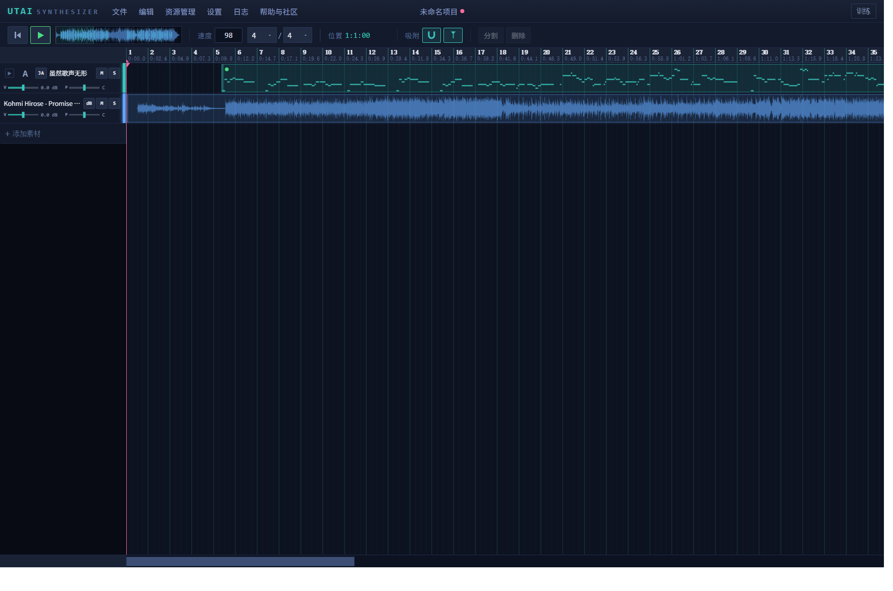
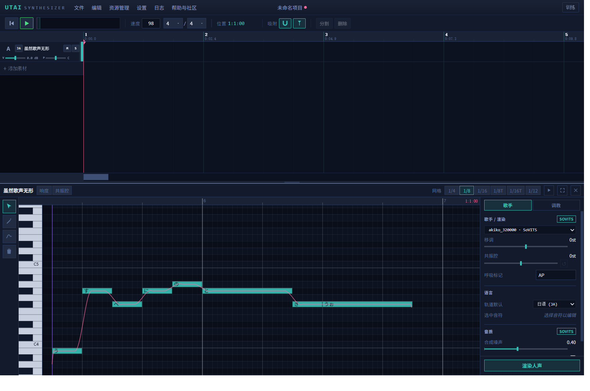
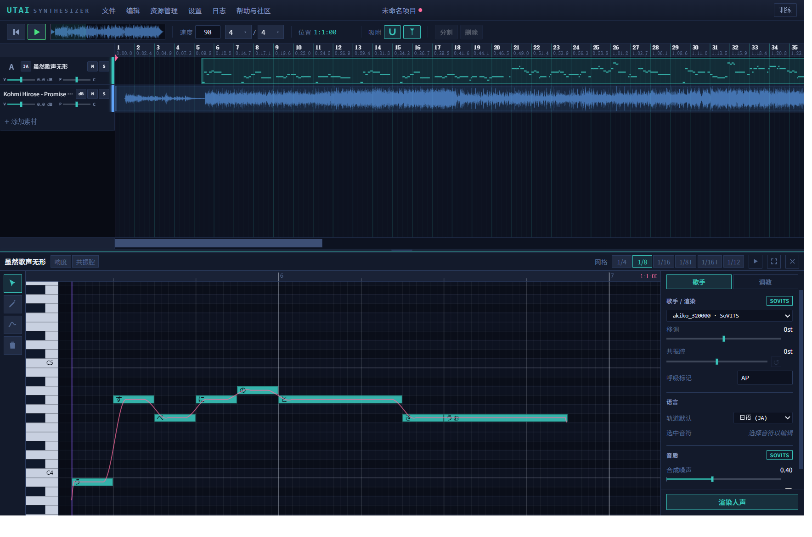
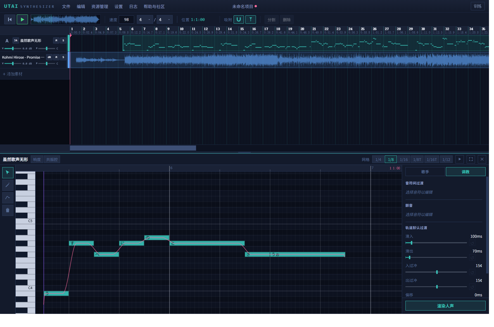
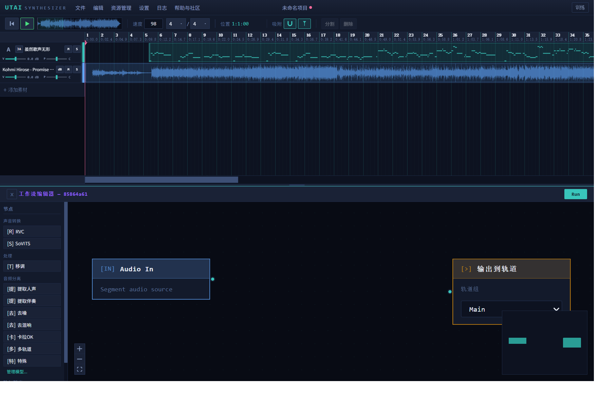
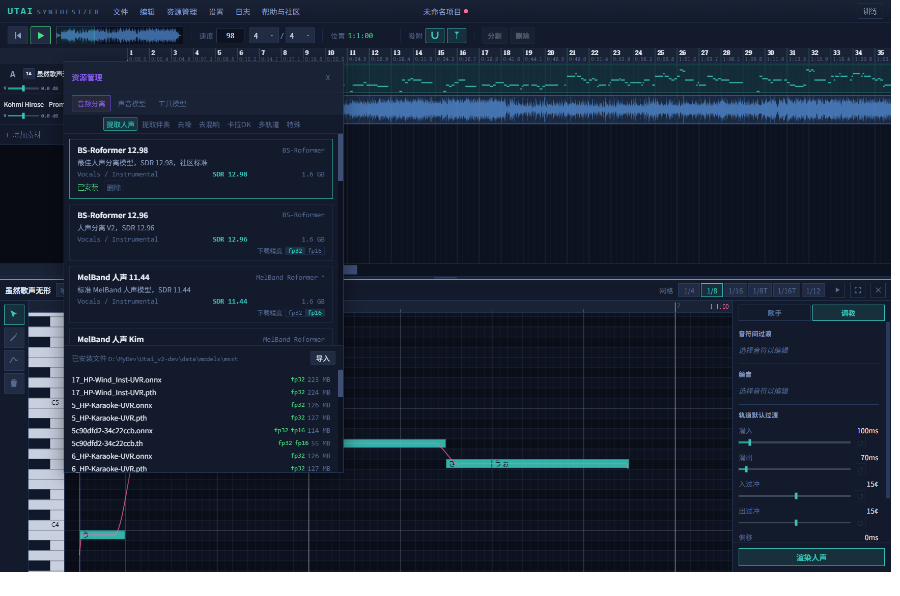
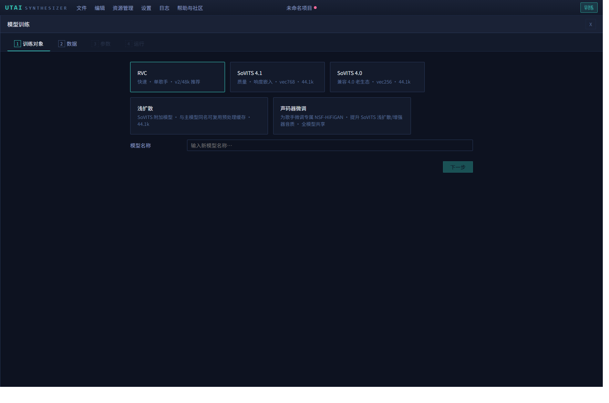
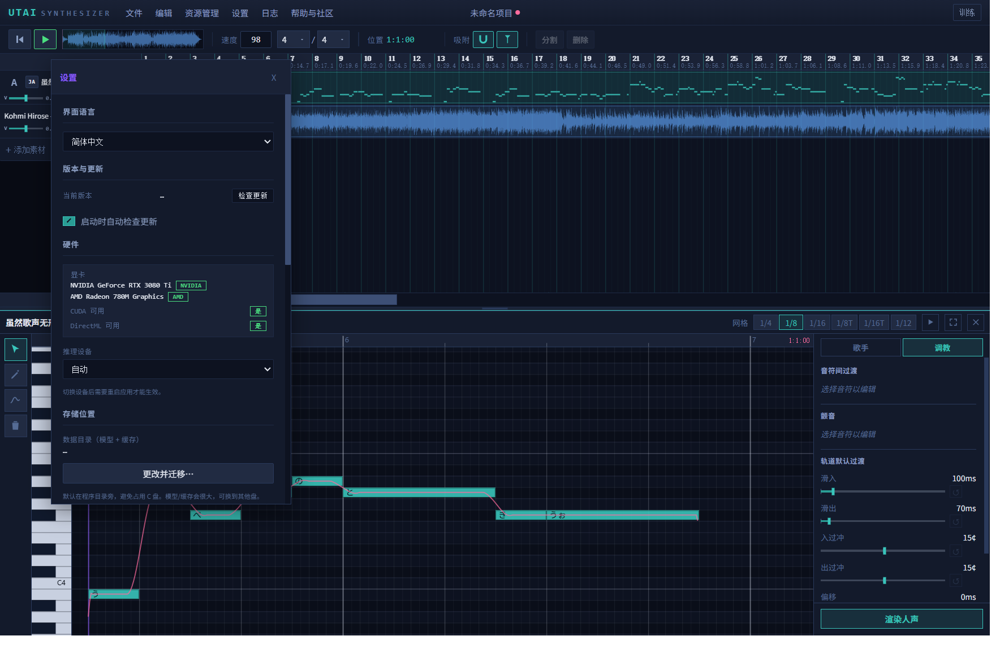

# UtaiSynthesizer User Guide

> A singing-voice workstation for Windows: write a score and hear it sung, make AI covers, separate vocals, and train models locally — all inside one app.

[简体中文](user-guide.zh-CN.md) | [English] | [日本語](user-guide.ja.md)

---

## Table of Contents

1. [Introduction](#1-introduction)
2. [Installation and First Launch](#2-installation-and-first-launch)
3. [Main Window Tour](#3-main-window-tour)
4. [Audio Tracks](#4-audio-tracks)
5. [Vocal Tracks and the Piano Roll](#5-vocal-tracks-and-the-piano-roll)
6. [Workflow Editor = AI Covers](#6-workflow-editor--ai-covers)
7. [Resource Management](#7-resource-management)
8. [Training](#8-training)
9. [Settings](#9-settings)
10. [Import and Export](#10-import-and-export)
11. [Project Files and Data Safety](#11-project-files-and-data-safety)
12. [Keyboard Shortcut Reference](#12-keyboard-shortcut-reference)
13. [FAQ and Troubleshooting](#13-faq-and-troubleshooting)
14. [Community and Feedback](#14-community-and-feedback)

---

## 1. Introduction

This chapter explains what UtaiSynthesizer is, what it can do, and the handful of core concepts used throughout this guide. After reading it you will know which piece of the puzzle each later chapter covers.

### 1.1 What is UtaiSynthesizer

UtaiSynthesizer is a singing-voice DAW (digital audio workstation) that does four things in one place:

- **Write a score, hear it sung**: draw notes in the piano roll, type lyrics, pick a singer model, and press Play to hear it sing. Lyrics are supported in seven languages: Chinese, English, Japanese, German, French, Spanish and Italian.
- **AI covers**: drag in a finished song, extract the vocals with a separation model, then swap the voice to another singer with an RVC or SoVITS voice model while the accompaniment stays intact (and can even be transposed as a whole) — the entire process happens in a node-based workflow.
- **Vocal separation**: a built-in download catalog of more than 40 separation models (vocal extraction, instrumental extraction, denoise, de-reverb, karaoke, multi-stem and more), ready to use in workflows once downloaded.
- **Local training**: no Python install, no command line — train your own RVC / SoVITS voice models, shallow-diffusion modules and vocoder fine-tunes inside the app, audition the results immediately, and import them with one click.

All inference runs on your own machine; no cloud service is involved.

### 1.2 Core concepts

Four terms come up again and again — meet them now:

- **Audio track**: a track for "existing audio files". Songs, accompaniments and recordings you drag in live on audio tracks, laid out on the timeline as clips.
- **Vocal track**: a track for "scores" (also called a MIDI track). Its clips contain notes and lyrics instead of audio, and a singer model renders them into singing.
- **Singer model**: an AI voice model that can sing, in two families — RVC (fast) and SoVITS (high quality). Import one in "Resources" or train your own on the training page.
- **Workflow**: the node graph every audio clip carries, describing how that clip should be processed — separation, voice conversion, transposition. Results land back on the track automatically and stay audible and editable at all times.

### 1.3 System requirements and languages

- The app is **Windows-only** (built on WebView2). The default window is 1400×900, minimum 1024×700.
- The interface is available in **简体中文 / English / 日本語**. The first launch defaults to Chinese; switch anytime in "Settings" → "Language" — it takes effect immediately, no restart needed.

### 1.4 How to read this guide

- Complete beginner: read Chapters 2 and 3 in order, then jump by goal — to **write songs**, read Chapter 5; to **make covers**, read Chapters 6 and 7.
- Just want to cover a song quickly: set things up per Chapter 2 → download a "Vocals" separation model per 7.1 → import a voice model per 7.2 → follow the step-by-step tutorial in 6.3.
- Hit a problem: go straight to Chapter 13 and find your symptom.
- Text in "double quotes" is real text on the interface — look for it and click it; `monospace` means a keyboard key.

---

## 2. Installation and First Launch

This chapter takes you from downloading the installer to finishing the essential first-launch setup. Pay special attention to 2.3 — without the "Core inference models" pack, vocal tracks cannot make a sound.

### 2.1 Download and install

1. Open the releases page and download the latest installer: <https://github.com/yasoukyoku/UtaiSynthesizer/releases>
2. Download the installer named `UtaiSynthesizer_x.y.z_x64-setup.exe` and run it.
3. The installer speaks 简体中文/English/日本語 (this language choice only affects the installer itself; the in-app language is set separately).
4. It installs into the **current user's directory** — no administrator rights required.

> Tip: the install directory is fully self-contained — copy the whole installed folder elsewhere (another drive, a USB stick) and it runs as-is, effectively a portable edition. Models and caches live in the `data` folder next to the program by default, and settings and crash-recovery files also live in the program directory, so they all travel with it.
>
> Caution: avoid placing the app under a path containing Chinese or other non-ASCII characters — the embedded Python environment used for training cannot work under such paths (the app shows a dedicated warning).

### 2.2 What you'll see on first launch

The window may take a second or two to appear the very first time — that is normal. On every later launch the app remembers your last window size and position.

After the first launch, walk through this checklist (each item is detailed in the sections below):

1. "Settings" → "Language" — switch the language if needed (default is Simplified Chinese).
2. "Settings" → "Download Source / Network" — mainland China users should switch to mirrors first; every later download will be much faster (see [9.9](#99-download-source--network)).
3. "Settings" → "Model Assets" — download the "Core inference models" pack (**required**).
4. "Settings" → "Hardware" / "CUDA Runtime" — NVIDIA users download the CUDA runtime and restart.
5. "Resources" — import or download the voice models / separation models you need (see [Chapter 7](#7-resource-management)).

### 2.3 Required: the "Core inference models" pack

Vocal-track synthesis, AI covers and pitch extraction all depend on a set of shared base models (about 1.4 GB). They are **not bundled with the installer** and must be downloaded once inside the app:

1. Click "Settings" in the title bar to open the settings panel.
2. Scroll to the "Model Assets" section.
3. Find "Core inference models"; if it shows "Missing", click "Download" next to it.
4. Wait for the progress bar to finish; the status becomes "Installed".

> Caution: without this pack, rendering vocals or running a cover workflow fails with errors like "Auxiliary file missing — place it into the indicated directory". An interrupted download is fine — clicking "Download" again resumes from where it stopped, and already-downloaded files are never fetched twice.

The same section also offers two more packs, "RVC training base models" and "SoVITS training base models" — you only need those if you plan to train your own models (see [Chapter 8](#8-training)).

### 2.4 GPUs and the inference device

The app accelerates AI inference with your GPU. "Settings" → "Hardware" shows the detected GPUs plus two status badges, "CUDA Available" and "DirectML Available"; below them, the "Inference Device" dropdown has four options:

- **"Auto"** (recommended): picks the first available in the order CUDA → DirectML → CPU.
- **"CUDA (NVIDIA GPU)"**: NVIDIA-only and fastest, but requires downloading the CUDA runtime first (see below).
- **"DirectML (Any GPU)"**: works with any GPU brand (NVIDIA / AMD / Intel), ships with the installer, works out of the box.
- **"CPU"**: the fallback when no usable GPU exists — much slower.

**NVIDIA users should install the CUDA runtime**: in "Settings" → "CUDA Runtime", click "Download CUDA Runtime" (about 1.6 GB). It is fully self-contained — you do not need to install the CUDA Toolkit yourself; the app downloads every runtime library automatically. **Restart the app** after the download to activate it.

**Multi-GPU machines can choose which card to use**: a "Preferred GPU" dropdown appears below "Inference Device", listing this machine's GPUs (greyed entries are virtual system adapters and cannot be selected). Under "Auto" it defaults to "Automatic (high-performance first)" but can be set to a specific card — "Auto" still decides between CUDA and DirectML; "Preferred GPU" only decides which card.

> Caution: changing "Inference Device" requires an app restart (the UI says so too: "Restart the app after changing device.", and a red hint shows which runtime this session actually loaded when a restart is needed); changing only "Preferred GPU" usually applies immediately (a few combinations, like picking the iGPU under "Auto", need the restart the red hint asks for). Also, a self-installed CUDA Toolkit 13 is not a substitute for this download (version mismatch) — use the in-app download.

### 2.5 The data folder

Models, caches, dictionaries and training data all live in one "data folder", which defaults to **the `data` folder next to the program** (deliberately not on the C: drive's user profile, because this folder grows to tens of GB).

To move it to another drive: "Settings" → "Storage" → "Change & migrate…", pick the new folder, and once the copy finishes and passes an integrity check you'll be prompted to restart (one-click "Restart now"). The old folder is cleaned up automatically on the launch after that restart — no need to hunt it down and delete it yourself.

(Installations upgraded from very early versions with data still in the system AppData folder keep working; Settings will suggest migrating off the C: drive.)

### 2.6 Automatic updates

About 3 seconds after startup the app checks for a new version automatically (turn this off with the "Check for updates on startup" checkbox under "Settings" → "Version & Updates"). When a new version is found, the "Update Available" dialog pops up with the release notes:

- Click "Update Now": the update downloads and installs automatically; the app closes and restarts. Unsaved changes are offered for recovery after the restart.
- Click "Later": skip this time; you can always check manually later with "Check for Updates" under "Settings" → "Version & Updates".

The download can be cancelled; the install phase cannot, and quitting the app is not allowed during it.

### 2.7 Moving the install (portable)

The app is fully portable: cut the **entire install folder** (default `C:\Users\<you>\AppData\Local\UtaiSynthesizer`) to any location — another drive, say — and double-click the `UtaiSynthesizer.exe` inside; models, the data directory and settings all travel with it. (Since v0.8.0 the logs and the UI cache also live inside the install folder — `logs\` and `webview\`; caches left in system directories by pre-0.8.0 versions are cleaned up automatically after the upgrade, leaving only a few-KB window-position memory file behind.)

Since v0.7.0, updates after a move also happen **in place**: the in-app updater installs straight into the folder the running copy lives in, and once the app has started at the new location once, manually downloaded installers recognize it too (the app re-points the Windows-recorded install location at itself).

Two caveats:

- If the old location still holds files after the move (i.e. it was actually a copy, not a cut), just delete the old folder in Explorer; **do not run the old folder's `uninstall.exe`** — it would also remove the new location's uninstall entry. After deleting the old folder, **start the app once more** so it re-points the install records at the new location (while the old copy still exists, the app deliberately leaves the records alone).
- Avoid keeping two copies in active use: during an update the installer closes the app by process name. (The app never touches the registry records of a copy that is still alive elsewhere.)

---

## 3. Main Window Tour

This chapter is a map: meet the main window's three regions — the title bar, the transport toolbar, and the track area. Later chapters refer to every control by the names given here.

### 3.1 The title bar

At the top of the window (just below the system title bar) sits the app's own menu bar, left to right:

| Button | Purpose |
| --- | --- |
| "File" | New / Open / Save / Save As / Import Score / Export Audio… / Export Score… (see [Chapters 10 and 11](#10-import-and-export)) |
| "Edit" | Undo / Redo / Copy / Cut / Paste |
| "Resources" | Opens the resource manager panel: separation models, voice models, tool models (see [Chapter 7](#7-resource-management)) |
| "Settings" | Opens the settings panel (see [Chapter 9](#9-settings)) |
| "Log" | Opens the log viewer (for troubleshooting, see [Chapter 13](#13-faq-and-troubleshooting)) |
| "Help & Community" | Shows the current version plus QQ group / Discord / GitHub links |

The center of the title bar shows the current project name ("Untitled Project" when unnamed); a small dot next to the name means there are unsaved changes. At the far right is the "Training" button; while training is running, a pulsing "Training" indicator appears next to it.

**The "File" menu** has seven items: "New" (`Ctrl+N`), "Open" (`Ctrl+O`), "Save" (`Ctrl+S`), "Save As" (`Ctrl+Shift+S`), "Import Score", "Export Audio…", "Export Score…". With no tracks in the project, Save / Save As / Export Audio are greyed out; with no vocal track containing notes, Export Score is greyed out. New/Open first show an "Unsaved Changes" confirmation when there are unsaved changes.

**The "Edit" menu**: "Undo" (`Ctrl+Z`), "Redo" (`Ctrl+Y`), "Copy" "Cut" "Paste" (`Ctrl+C/X/V`). Undo/Redo route automatically — with the workflow editor open and focused they act on the node graph's own history, otherwise on the timeline. Copy/Cut/Paste act only on the arrangement view's clip selection (the piano roll has its own independent note copy/paste while focused).

**The "Log" viewer**: clicking "Log" opens a draggable floating panel streaming the app's backend log in real time. The top toolbar filters by "All" "Error" "Warning" "Info" "Debug", has a search box (matches message text or module name), and a "COPY" button that copies every currently filtered line to the clipboard. The list auto-scrolls to the newest entry; scrolling up pauses auto-scroll, scrolling back to the bottom resumes it. The footer shows "filtered/total" counts and the log file's path on disk. It is your best friend when reporting bugs (see [Chapter 13](#13-faq-and-troubleshooting)).

**The "Help & Community" menu**: the first row shows the current version (e.g. UtaiSynthesizer v0.1.4); below it, four links open in your system browser: "QQ Group", "Discord Community", "Score2ConVec (GitHub)", "Project Home (GitHub)".

### 3.2 The transport toolbar

The row of controls above the track area:

- **Return-to-start button**: stops playback and puts the playhead back at bar 1.
- **Play/Pause button**: same as pressing `Space`. When you press Play, any changed vocal tracks are rendered first (a "Rendering changed vocal tracks…" notice shows; pressing again at that moment cancels the render instead of playing); a brief "Loading audio…" preparing state may follow, then sound starts. Playback runs all the way to the end of the last clip box before stopping naturally (silence after audio shorter than its box is played through too), and the playhead stays at the end. Pressing Play with the playhead already at the end starts from the beginning. There is no loop playback.
- **Minimap**: a thumbnail of the whole project. Drag the highlighted box to scroll the view; click anywhere outside the box to jump the playhead there (works during playback too).
- **"BPM"**: the project tempo (an integer, 20–400). Click to type or nudge with the arrows; `Enter` commits; the whole edit is one undo step.
- **Time signature**: two dropdowns (numerator 1–16, denominator 2/4/8/16). It only changes the bar/beat grid — no clip or note moves.
- **"Position"**: the playhead position readout, formatted `bar:beat:subdivision` (e.g. `3:2:01`).
- **Snap**: two toggles — "Snap clips (start/end/playhead)" makes moving/resizing clips align to other clip edges and the playhead; "Snap playhead to clip edges" makes dragging the playhead align to clip edges. Both default to on; the state is remembered across sessions.
- **"Split"**: cuts the selected clip in two at the playhead (same as `Ctrl+K`).
- **"Delete"**: deletes the selected clips (same as `Delete`).

### 3.3 The track area

- The left 200px column is the **track headers**: track name, mute/solo, volume/pan faders and so on (details in Chapters 4 and 5).
- The right side is the **canvas timeline**: clips, waveforms, and the playhead (a pink vertical line) are drawn here; edit directly by dragging with the mouse.
- Along the top is the **ruler**: bar numbers and real time (min:sec). Click/drag it to move the playhead (dragging to the view edge auto-scrolls; you can drag past the last clip into empty space).
- At the bottom sits a horizontal scrollbar; at the bottom of the track list is the "Add" button.

> Tip: clicking empty canvas moves the playhead and also **clears the clip selection** (`Ctrl+click` does not). The playhead is pink and brightens when the mouse comes near, hinting that it can be grabbed.

**Zoom and scroll gestures** (on the canvas): wheel = horizontal scroll; `Shift+wheel` = vertical scroll; `Ctrl+wheel` = horizontal zoom (anchored at the cursor); `Alt+wheel` = vertical zoom (changes track heights).

> Tip: this is a "desktop-app-ified" interface — browser shortcuts (`Ctrl+F` find, `F5` refresh, `Ctrl+wheel` page zoom, etc.) are deliberately suppressed. Nothing happening when you press them is normal.

---

## 4. Audio Tracks

This chapter covers everything about audio tracks: importing audio, editing clips, what each track-header button means, managing the sub-lanes produced by workflows, plus loudness envelopes, BPM detection and time-stretching.

### 4.1 Three ways to import audio

Supported formats: wav, mp3, flac, ogg, aac, m4a, webm, opus, wma.

**Method 1: the Add button**

1. Click "Add" at the bottom of the track list.
2. Pick "Add Audio" and choose a file in the dialog.
3. The app creates a new track named after the file, with the clip placed at the current playhead.

(The same menu also offers "New Audio Track" and "Create MIDI Track", which create an empty audio track and an empty vocal track respectively. An empty project's canvas also shows the hint: "Drop audio files or add a new track".)

**Method 2: drag and drop from Explorer (recommended)**

Drag one or more audio files from Windows Explorer straight onto the timeline:

- While dragging, each file shows a dashed blue "ghost" preview whose size matches the file's real duration, helping you aim.
- Drop onto an audio track: the clip is inserted into that track (if it would overlap existing clips, a new track is created above/below automatically).
- Drop near the boundary between two tracks: the tracks visibly "split apart", showing a new track will be inserted there.
- Multiple files at once: the first is placed by the rules above; each of the rest gets its own new track.
- After you release, clips first show a striped loading animation with a "Loading" label, then fill in with the real waveform once decoded. The whole drop is one undo step.

**Method 3: right-click a track boundary**

In the track header column, hover over the boundary between two tracks (a hint line appears), right-click, and the menu offers the same "Add Audio" "New Audio Track" "Create MIDI Track" — the new track is inserted at that boundary.

### 4.2 Selecting and editing clips

- **Select**: click a clip (a golden outline appears); `Ctrl+click` adds to / removes from the multi-selection; clicking empty space clears the selection (and moves the playhead there).
- **Move**: hold and drag a clip (movement only starts past 3 pixels, to prevent accidental nudges). A multi-selection drags together. Dragging a single clip vertically onto another track of the **same type** moves it across tracks (audio↔audio, vocal↔vocal).
- **Resize**: drag a clip's left/right edge (6-pixel hot zone, cursor becomes ↔). The right edge changes length; the left edge also shifts the clip's "viewing window" into the source audio. Minimum length is a quarter beat.
- **Split**: select a clip, put the playhead where you want the cut, and press `Ctrl+K`, or click "Split" in the toolbar, or right-click → "Split". Splitting an audio clip does not reprocess anything — render results, node graphs and envelopes are all inherited correctly.
- **Delete**: select and press `Delete`, or click "Delete" in the toolbar, or right-click → "Delete". Deleting a clip that is currently rendering cancels that render.
- **Crossfade**: there is no dedicated tool — just **drag two clips on the same track into overlap**. The overlap gets an automatic linear crossfade, shown with an X mark on the canvas.

A few details while dragging: with snap on, a clip edge within 8 screen pixels of another clip edge or the playhead snaps onto it and a dashed guide line is drawn (screen pixels are fixed, so zooming in = finer snapping); dragging to the canvas edge auto-scrolls; each move/resize collapses into one undo step on release; editing during playback reschedules audio live.

> Caution (moving vocal clips across tracks): moving a vocal clip to a track with a **different singer** makes it "dirty" — the next Play automatically re-renders it with the new singer. Moving it to a track **without a singer** discards the rendered audio it carries (move it back to a track with a singer and re-render to recover). A vocal clip cannot move across tracks while it is rendering.

**What happens when you change the BPM**: when you change "BPM", audio clips keep their **real-time** position and length (they stick to seconds), score clips keep their **musical** position (they stick to the bar grid), and the playhead stays where you were hearing — so changing tempo never scrambles alignment. Rendered vocals become "dirty" and re-render on the next Play. Changing the **time signature** only redraws the bar/beat grid; no clip or note moves.
- **Copy/Cut/Paste**: `Ctrl+C` / `Ctrl+X` / `Ctrl+V`, or right-click menu "Copy" "Cut" "Paste". Paste lands at the playhead on the target track; if the spot is occupied, a new track is created below automatically. Copying brings the node graph, render results and mix settings along — the pasted copy does not need re-rendering.
- **Duplicating a whole track**: right-click a track header → "Copy Track", then right-click → "Paste Track"; a complete copy named "\<original name\> copy" is inserted below.

Paste fine print:

- The paste target is "the track you right-clicked"; failing that, the currently selected/active track.
- If the explicitly chosen target track has the wrong type (e.g. pasting an audio clip onto a vocal track), nothing happens except the notice "Clipboard content doesn't match the target track type".
- If the target position is occupied, a new track of the correct type is created below to hold the paste (a new vocal track inherits the reference track's singer, so clips never go mute).
- "Cut" = copy + delete, collapsed into one undo step.

> Tip: this clipboard is internal to the app — restarting the app or creating/opening a project clears it. "Loading" placeholder clips that are still decoding cannot be selected, moved, split or copied — wait for the waveform to appear first.

**A thoughtful waveform detail**: once sub-lanes become the actual playback source, the main clip row's waveform switches to "the audible sum of the sub-lanes" (respecting each row's mute and slice edits) — **what is drawn is what you hear**. With `O` lit (playing the original), the original waveform returns. A vocal clip shows a note thumbnail before rendering; after rendering, its sub-lane shows the sung waveform at true 1:1 time.

### 4.3 Track header buttons, one by one

Each audio track's header (top to bottom, left to right):

| Control | Meaning |
| --- | --- |
| Track name | Double-click to rename; `Enter` commits, `Esc` cancels |
| `M` | Mutes this track |
| `S` | Solo — while any track is soloed, all non-soloed tracks are silent |
| `V` | Volume fader: −24 dB to +24 dB in 0.5 dB steps; dragging to the very bottom shows "-∞ dB" (full mute); the value is always visible |
| `P` | Pan fader: −1 to +1 left/right, shown as `L50` / `C` / `R50` |
| `O` | Source selector (appears once sub-lanes exist): lit = play the **original imported audio**, all sub-lanes leave the output; unlit = play the processed sub-lanes. Use it to A/B the original against the processed result |
| `dB` | Opens/closes this track's loudness envelope editing band (see 4.5) |
| `▶`/`▼` | Expand/collapse sub-lanes (a pure view toggle — never changes what you hear) |
| Right-edge color bar | The "track light": its color shows the track type; it glows when the track is actually sounding right now (not muted, not excluded by solo, has content). **Hold and drag it up/down to reorder tracks** |

Fader changes apply to playback live; each drag is one undo step.

### 4.4 Sub-lanes and lane groups

When a workflow processes an audio clip (say, separating vocals and accompaniment), the outputs attach below the track as **sub-lane** rows. Click the track header's `▶` to expand:

- Above each group of sub-lanes sits a thin **group bar**: a color chip, the group name, a "dB" group-envelope toggle, and group-level `V` / `P` faders (volume/pan shared by the whole group).
- Each sub-lane row shows its stem name (e.g. Vocals / Instrumental) and its own `M` mute button.
- The main clip row's waveform switches automatically to "the audible sum of the sub-lanes" — what you see is what you hear.

**Non-destructive sub-lane editing**: clicking a sub-lane row selects its whole group (golden outline); dragging an edge trims it (the trimmed part turns into a dark base = silence; drag back to restore); park the playhead and press `Ctrl+K` (or right-click → "Split") to cut there; `Delete` (or right-click → "Delete") removes the piece you clicked, leaving silence. All of this is just a "recipe" — the rendered audio files are never modified, and everything is undoable.

> Caution: sub-lanes are pinned to their parent clip — they cannot be moved independently or dragged to other tracks. `Ctrl+K` / `Delete` act on sub-lanes only while a sub-lane selection is "alive" (track expanded, a piece clicked); otherwise they fall through to the parent clip.

**Ungrouping**: a group's multiple stems share one volume/pan. To mix each stem separately, right-click a sub-lane → "Ungroup" (only shown when the group has 2+ inputs). The group splits into one group per stem; the audio stays in place, nothing re-renders.

**Extract MIDI from a sub-lane**: right-click a vocal stem's sub-lane → "Extract MIDI (vocal→notes)", and the app transcribes the sung melody into notes. Key points:

- Requires the GAME engine downloaded in "Resources" → "Tool Models" first (see 7.5); if missing, the download entry opens automatically.
- **Every stem** in the group produces its own new vocal track, inserted right below the source track and named "\<sub-lane name\> MIDI".
- The notes carry no lyrics (the track language's default lyric is used as a placeholder) — this feature is designed for re-writing lyrics onto covers. Note boundaries are quantized to 1/12 beat, which covers both straight and triplet feels.
- Extraction can take a few minutes; the sub-lane shows "Extracting MIDI…" with a percentage; pressing `Ctrl+Z` during extraction cancels it. The whole extraction is one undo step.
- If the source clip is edited/moved/deleted during extraction, the result is dropped (notice: "Segment changed during extraction — result dropped").
- Extracting from an accompaniment stem runs too — but the output is whatever the model "hears"; do not expect a clean melody.

### 4.5 Loudness envelopes (point editing)

Click a track header's `dB` button and a dedicated editing band unfolds beneath the track (and its sub-lanes). Each clip gets a **loudness envelope** centered on a 0 dB dashed line with a ±12 dB range:

1. Press on empty space in the band: a control point is inserted and you drag it immediately.
2. Hold an existing point and drag: horizontally it moves between its neighbors; vertically it adjusts in 0.1 dB steps.
3. Right-click a point: deletes it.

The envelope applies to playback live (edits during playback take effect immediately). Closing the `dB` band keeps the envelope in effect — it just is not drawn. The "dB" toggle on a sub-lane group bar works the same way — when on, that group's rows switch into envelope-editing mode (slicing/trimming is unavailable meanwhile), and the group envelope **adds in dB** to the main envelope.

### 4.6 BPM detection and grid correction

To find out a piece of audio's tempo and draw a beat grid inside the clip:

1. Right-click the audio clip → "Detect tempo / grid".
2. A few seconds later a vertical grid appears inside the clip (downbeat lines are longer) with a readout like "158.0 BPM". A `~` after the number means the tempo was detected as non-constant (the grid is advisory only); a `?` means low confidence.
3. If the grid is double/half speed: right-click → "Grid BPM ×2" or "Grid BPM ÷2".
4. If the bar lines land on the wrong beat: right-click → "Shift bar line +1 beat" (repeat as needed).
5. Done with it? "Clear tempo grid".

The grid is anchored to the source audio's own time — splitting, resizing or time-stretching the clip afterwards never scrambles it; a stretched clip's readout shows the **effective tempo** (already divided by the stretch ratio).

> Caution: clips that are too short (under ~5 seconds) report "Segment too short for tempo detection (needs ~5 s)"; material with an unsteady pulse may report "No steady beat detected".

### 4.7 Time-stretch (Tempo)

To make audio faster/slower without changing its pitch:

1. Right-click the audio clip → "Time-stretch…".
2. Drag the slider in the panel: clips with a detected grid set a "Target BPM" (with "Detected BPM" shown alongside); undetected clips set a "Speed" percentage. The readout shows the resulting duration percentage.
3. Click "Apply". While the button shows "Processing…" the app is generating high-quality stretched audio offline (the source audio and all rendered stems are processed), and the change is only committed once done (undoable).
4. Click "Reset 1:1" to undo the stretch.

> Tip: the slider's travel is wide (duration ⅓×–3×), but the engine's sweet spot is 0.75–1.5×; the further out you go, the more audible the artifacts. With many clips and stems, "Apply" can take a while.

### 4.8 Clearing renders

Right-click a clip that has workflow render results → "Clear Render": all sub-lanes disappear and playback returns to the original audio. The node graph and its parameters are untouched — one more Run brings everything back. Note that clearing a render is **not** an undo step (`Ctrl+Z` will not bring it back), but since the render cache is still there, re-running is usually fast.

---

## 5. Vocal Tracks and the Piano Roll

This chapter is the heart of the guide: making the app sing. From creating a vocal track, drawing notes and writing lyrics, to tuning pitch, vibrato and parameter curves, to what every sidebar knob means and how rendering works.

### 5.1 Creating a vocal track and opening the editor

1. Click "Add" at the bottom of the track list → "Create MIDI Track" to get an empty vocal track.
2. **Double-click empty space on the vocal track**: a new one-bar score clip is created in that bar and the piano-roll editor opens at the bottom — this is how you start writing a song.
3. From then on, double-click any score clip to reopen the editor.

The editor docks at the bottom of the window (mutually exclusive with the workflow editor — opening one closes the other). Drag the divider above it to adjust its height (the height is remembered). A quick reference for the controls along the editor's top:

| Control | Purpose |
| --- | --- |
| Track name | Shows which track you are editing |
| "Loudness" "Formant" | Toggle the bottom parameter band (see 5.9) |
| "Preview" / "Stop" | Plays a placeholder tone along the pitch line (see 5.11) |
| "Grid" button group | 1/4 · 1/8 · 1/16 · 1/8T · 1/16T · 1/12 (see 5.3) |
| "Maximize" / "Restore" | Fill the track area with the editor / back to docked |
| "Close" | Return to the arrangement view |

The editor closes itself when its clip is deleted or the project is replaced; switching to another clip resets the view.

**Picking a singer for the track**: the avatar spot at the far left of a vocal track's header is a button. Clicking it pops up a list of all installed voice models (SoVITS and RVC); picking one sets the singer for the **whole track**. With no models installed, it shows "No singer models available — import one in the Resource Manager first" (see [Chapter 7](#7-resource-management)).

### 5.2 The four tools

The column on the editor's left has four tool buttons (click to switch):

**"Select / move" (arrow, the default tool)**
- Click a note to select it (it plays a short audition tone); `Shift/Ctrl+click` multi-selects.
- Drag a note's body to move the whole selection; horizontal and vertical movement each need to exceed 4 pixels to start, so a vertical drag never drifts sideways. Horizontal movement steps by 1/12 beat (regardless of the grid setting); vertical movement is by whole semitones.
- Drag a note's right edge (cursor becomes ↔) to change its length.
- Drag on empty space for a box selection (`Shift/Ctrl` adds to the selection).
- `Ctrl+drag` on empty space = draw a new note directly (no need to switch to the pen).
- On release, overlapping notes are trimmed or removed automatically (one note per position; exact head-to-tail adjacency is a legal legato).

**"Draw notes" (pencil)**
- Drag left-to-right on empty space: the start snaps down to the current grid, and the length extends by grid cells (minimum 1/12 beat). New notes get the track language's default lyric (Chinese "啊", Japanese "あ", other languages "a").
- Clicking an **existing** note with the pencil and dragging lengthens/shortens its tail — the pencil never moves notes.

**"Pitch" (wave)**
- Drag in the note area to hand-draw the target pitch line (continuous, finer than a semitone). On release, the difference from the automatic pitch line is stored as the clip's "pitch deviation" — only the region you drew is replaced, with smooth falloff at both ends, so a local fix never derails the whole clip.
- A sustained tone follows while you draw — you hear what you draw. Mistakes? Just redraw over the same region, or `Ctrl+Z`.

**"Delete" (trash can)**
- With this tool the canvas edges glow red and the cursor becomes a crosshair. Click a note to delete it instantly; drag out a **red** dashed box to delete every note inside on release (one undo step).
- Normal selection boxes are cyan, delete boxes are red — the color tells you what release will do.

> Caution: lyrics cannot be edited by double-click under the "Pitch" and "Delete" tools — switch back to the arrow or pencil after tuning. Tools are switched only by clicking their buttons — the (1)–(4) numbers in the tooltips currently have no keyboard shortcuts.

### 5.3 Grid and view controls

**Grid**: the row of buttons labeled "Grid" at the editor's top: `1/4`, `1/8` (default), `1/16`, `1/8T`, `1/16T`, `1/12` — the T variants are triplet grids (1/8T = 3 per beat, 1/16T = 6 per beat), and `1/12` is the finest unit (12 per beat). The grid decides **where new notes land and how long they are**, plus the arrow keys' nudge step; moving/resizing existing notes **always** steps by 1/12 beat regardless of the grid — you never need to switch grids just to fine-tune. Canvas lines have a clear hierarchy: bar lines are thickest, then beat lines, then subdivision lines; a snapped vertical guide follows the mouse.

**Scrolling and zooming** (note the axes differ from the arrangement view):

| Gesture | Effect |
| --- | --- |
| Wheel | Vertical scroll (pitch axis) |
| `Shift+wheel` | Horizontal scroll (time axis) |
| `Ctrl+wheel` | Horizontal zoom, the position under the cursor stays put |
| `Alt+wheel` | Row-height zoom (6–40 pixels per semitone), the pitch under the cursor stays put |

The editor's view is independent of the arrangement view's zoom/scroll. On opening it auto-centers vertically on the notes' average pitch (an empty clip centers on C4). Horizontal scrolling is limited to near the clip's right edge, so you never scroll off into irrelevant emptiness.

**Ruler and playhead**: the thin strip at the editor's top is a bar-number ruler — clicking/dragging it moves the **global playhead** (during playback too; audio reschedules where you release). After editing a passage, click back here to re-listen without returning to the arrangement view. The piano-key column on the left labels the C notes (C4 etc.), with black-key rows in a darker shade; clicking a piano key plays an audition tone at that pitch.

**Clip boundaries**: the area outside the clip (purple boundary lines) is dimmed — notes placed out there are outside the clip and will mostly not be rendered into sound. To lengthen the singable region, go back to the arrangement view and stretch the clip first.

**Note clipboard and nudging** (while the editor is focused):

- `Ctrl+C` / `Ctrl+X` / `Ctrl+V`: copy/cut/paste notes. This is a note clipboard **independent of the clip clipboard**; paste lands at the **current mouse position** (the earliest note aligns to the beat under the pointer, relative spacing preserved) — hover the target spot first, then press `Ctrl+V`. Pasting across clips works within the same session.
- `Ctrl+D`: duplicate the selection in place, shifted right by one grid step — the fastest way to lay down repeating phrases.
- `Ctrl+A`: select all; `←`/`→` nudge by one grid step, `↑`/`↓` transpose by semitone (the group moves as one and stops as one at the boundary — no deformation).
- `Esc` cancels in layers: stop the preview → then cancel an in-progress drag → finally clear the selection.

### 5.4 Writing lyrics

1. With the arrow or pencil tool, **double-click a note**; an inline input box pops up.
2. Type and press `Enter` to commit; `Esc` cancels; clicking elsewhere (blur) also commits.
3. Press `Tab` to commit and jump to the **next** note's lyric box, `Shift+Tab` for the previous — just keep tabbing to fill in a whole line.

**Whole-phrase distribution**: typing/pasting a whole sentence into one note's box distributes it across the following notes:

- Multiple space-separated words → one word per note.
- An unspaced run of Chinese characters → one character per note (heteronyms are disambiguated by phrase context at render time).
- An unspaced run of kana → split by mora (small kana attach to the preceding character automatically).
- Anything else (e.g. a single English word) → stays whole on the current note.

**Reserved tokens** (work in any language):

| Token | Meaning |
| --- | --- |
| `-` or `ー` | Sustain: continues the previous syllable's vowel |
| `+` | Takes the previous word's next syllable (for multi-syllable Western words spanning notes) |
| `R` / `rest` / `sil` / `pau` | Rest |
| `AP` / `ap` | Breath (see 5.8) |

Lyrics are single-line, at most 64 characters; clearing a lyric falls back to the track language's default lyric.

### 5.5 Seven languages: track default and per-note override

Seven languages are supported; the language decides how lyrics turn into phonemes:

| Badge | Language | Lyric-writing hint |
| --- | --- | --- |
| ZH | Chinese | Write hanzi directly; heteronyms auto-disambiguate by phrase context |
| EN | English | Write by word; span multi-syllable words across notes with `+` |
| JA | Japanese | Hiragana/katakana; small-kana combos handled automatically (the default language) |
| DE | German | Write by word, continue syllables with `+` |
| FR | French | Same as above |
| ES | Spanish | Same as above |
| IT | Italian | Same as above |

- **Track default language**: a new vocal track defaults to Japanese (JA). Two ways to change it — click the two-letter badge next to the singer avatar in the track header (e.g. "JA") for a seven-language menu; or change "Track default" in the sidebar "Singer" tab's "Language" section.
- **Per-note override**: select some notes and give them their own language in the "Selected notes" dropdown of the sidebar "Language" section; choosing "Follow track" clears the override. Mixing several languages inside one clip is fully supported.

> Caution: switching languages can make existing lyrics "unpronounceable" — see OOV in the next section.

### 5.6 OOV: the red "can't pronounce this" marks

When a note's lyric cannot be found in its effective language's dictionary (Out-Of-Vocabulary), the app flags it in red at **three levels** at once:

1. The **note** turns red in the piano roll.
2. The **clip** gets a red warning triangle at its top-right corner in the arrangement view (a green dot at the top-left means "has render results" — do not confuse the two).
3. The **track header** shows a red warning triangle whose hover text reads: "Unrecognized lyrics (OOV) — check the lyric or the note/track language".

**What to do**: either fix the lyric's spelling, or switch the note/track language to the one matching the lyric. The red marks clear themselves within about 0.3 s of the fix. Rendering with OOV present produces a clear error naming the offending lyric.

> Tip: if the error says "Pronunciation dictionary missing" instead of OOV, the dictionary file itself is missing/broken — see [Chapter 13](#13-faq-and-troubleshooting).

### 5.7 Pitch: transitions, vibrato, edge glides, freehand drawing

The pink pitch line always shows **the pitch that will actually be sung** (note pitch + transitions + hand-drawn deviation + vibrato). By default every pair of adjacent notes already glides together naturally — you only fine-tune where you want extra nuance.

Open the sidebar's second tab, "Tuning" — three sections:

**"Note transition"** (applies to the currently selected notes):
- "Offset": the transition center's offset from the note boundary (±500 ms).
- "Arrive" / "Leave": how long the glide into / out of this note takes (0–1000 ms; track defaults 100/70 ms).
- "Overshoot in" / "Overshoot out": how far the transition "overshoots and comes back" at each end (±600 cents, default 15).
- "Edge scoop": the attack scoop-up / release fall-off for a phrase's first/last note (the end with no neighbor) (0–600 cents, default 200).
- Every slider is an optional override — the label lights up when overridden, and the circular arrow next to it is a one-click "Reset to track default".

**"Vibrato"**:
- Select notes and click "Add vibrato" to get the default vibrato (depth 100 cents, rate 5.5 Hz).
- Six sliders: "Depth" "Rate" "Phase" "Onset" "Fade in" "Fade out".
- "Remove vibrato" clears it. The sliders affect only selected notes that **already have** vibrato.

**"Track default transition"**: the baseline every note inherits, each item with a "Reset to default" arrow.

All time parameters are absolute milliseconds — they do not change with BPM, and they travel with the notes when notes move. With a multi-selection, the sliders show the first note's values and edits apply to all (the UI shows a ×N count); the whole multi-edit is one undo step. A vibrato with depth 0 is the same as no vibrato.

Add the **"Pitch" tool's freehand drawing** from 5.2, and that is the complete pitch-tuning toolkit.

### 5.8 Breath marks (AP)

Notes whose lyric is `AP` or `ap` render as an **inhale** rather than a sung word. Breath notes are unvoiced: the pink pitch line breaks over them, the previous note releases naturally and the next note re-attacks.

The sidebar "Singer" tab has a "Breath token" text box (default `AP`) which you can change to any word you like — say, when AP happens to be a real word in some language. Even with a custom token set, `AP`/`ap` always keep working.

### 5.9 The bottom parameter band: loudness and formant

Next to the editor's title are the "Loudness" and "Formant" buttons; clicking one unfolds an 88px parameter band at the canvas bottom (one parameter shown at a time; clicking the active button closes it):

- **"Loudness"**: a ±12 dB per-frame volume curve that becomes the vocal's volume envelope at render time.
- **"Formant"**: a ±12 semitone resonance-shift curve — positive is brighter/younger, negative is darker/fuller, pitch unchanged.

Editing works exactly like audio-track envelopes: press empty space to insert a point and drag, drag existing points, right-click to delete; values quantize to 0.1; each gesture is one undo step. The dashed center line is 0 (no change). The curves are render parameters — changing them makes the clip "dirty", and the next Play re-renders automatically.

> Tip: while the parameter band is open it takes a slice of the note area's height (the scroll position adjusts automatically). No points drawn = a pass-through that does not affect the sound at all. Deleting the last point clears the curve.

### 5.10 The "Singer" tab, control by control

The sidebar's first tab, "Singer", top to bottom:

**"Voice / Render"**
- Singer dropdown: lists every installed SoVITS + RVC model (shown as "name · backend"); choosing one sets the singer and the backend automatically. When empty it shows "No voice models" and an "Import in Resource Manager" button.
- "Transpose": ±24 semitones, applied at render time — the written notes stay put while the sung result shifts up/down as a whole.
- "Formant": a ±12 semitone track-wide resonance scalar, **added** to the bottom formant curve. Has a reset arrow.

**"Tone / Quality"** (differs by backend; shows "Pick a singer first" until a singer is chosen)

SoVITS models:
- "Noise scale" (0–1): the synthesis noise factor.
- "Cluster ratio" (0–1): shown only when the model has cluster/retrieval assets.
- "Shallow diffusion" toggle: shown only when the model has a diffusion attachment. Turning it on reveals a "Sampler" dropdown, "Diffusion steps" (10–1000) and "Speedup" (1–100).
- "NSF enhancer" toggle (shown while diffusion is off): helps under-trained models.
- "Vocoder" dropdown (shown while diffusion or the enhancer is on): the default vocoder or an imported matching one.

RVC models:
- "Noise scale" (0–1).
- "Index ratio" (0–1): shown only when the model has an index file.
- "Consonant protect" (0–0.5).

**"Range extend"**: this toggle only appears if the current singer has had its **range tested** in the resource manager (see 7.4). When on, phrases beyond the singer's comfort zone are first transposed into the comfort zone for rendering, then shifted back in the audio domain — a low-voiced singer can sing a high song, at the cost of a slight timbre change over those passages. Off by default.

**"Breath token"**: see 5.8.

**"Language"**: the "Track default" and "Selected notes" dropdowns, see 5.5.

Every slider drag / toggle flip is one undo step, and each makes the rendered audio "dirty" (auto re-render on the next Play).

### 5.11 Preview and rendering

**Placeholder preview (no rendering)**:
- Drawing notes, dragging them, and clicking piano keys plays a light placeholder tone instantly (a triangle wave, not the singer's voice), retuning live as you move.
- The **"Preview"** play button next to the editor title sweeps the whole clip from its start along the **exactly computed pitch line** — transitions, vibrato and hand-drawn deviations are all audible without waiting for a render. Click again ("Stop") or press `Esc` to stop.

**Real rendering (the singer sings)**, two paths:

1. **Manual**: the pinned "Render vocal" button at the sidebar's bottom (it turns into "Rendering…" while running; disabled when no singer is picked / there are no notes / a render is already running).
2. **Automatic**: just press `Space` to play — every changed vocal clip renders first (notice "Rendering changed vocal tracks…", the Play button pulses, the rendering track's header shows a spinner; pressing `Space` again at this point **cancels the render**), then playback starts. Unchanged clips are skipped entirely — zero extra waiting. If a cover workflow is rendering at that moment, Play skips the auto-render and plays the existing results (the two share one voice engine and never interrupt each other). Exporting audio runs the same auto-render first, too.

**What counts as "changed"**: any edit to notes/lyrics/pitch/curves, a BPM change, or a change to transitions/vibrato/quality/language/singer makes a clip "dirty". Unchanged clips are never re-rendered. Splitting an already-rendered clip does **not** trigger a re-render either (both halves inherit the windowed audio directly).

On a first render the clip shows a loading placeholder; on a re-render the old audio keeps playing until the new render lands; a failed render restores the previous state. The green dot at a clip's top-left = has render results.

**Common render errors** (batch renders triggered by Play prefix the track name; at most 3 are shown plus one summary):

| Message | Cause and fix |
| --- | --- |
| "Pick a voice model first" | The track has no singer — pick one via the track-header avatar or the sidebar dropdown |
| "No notes to render" | The clip is empty |
| "A render is already in progress" | Only one vocal render runs at a time — wait for it |
| Lyric "××" cannot be mapped to phonemes (OOV) | See 5.6 — fix the lyric or the language |
| "Pronunciation dictionary missing" | Dictionary files are missing, see Chapter 13 |
| "Render failed: …" | Anything else — follow the details or ask for help with the log |

> Tip: rendering runs on the GPU; long clips take a moment. Render results never occupy undo history — `Ctrl+Z` will not delete rendered audio. Also note: tracks without a singer are **silently skipped** by the Play-triggered batch render (they simply cannot render) — to see the explicit error, use the sidebar's "Render vocal" button.

---

## 6. Workflow Editor = AI Covers

This chapter covers the node-based workflow attached to audio clips — the complete AI-cover pipeline happens here: separate the vocals → convert the voice → transpose the accompaniment → results land on the track.

### 6.1 Opening the editor

**Double-click any audio clip** and the workflow editor opens at the bottom of the window (a score clip opens the piano roll instead — routing is automatic by content type). The panel is titled "Workflow Editor"; the `x` at its top-left closes it; drag the divider to adjust its height.

Every audio clip has **its own node graph**. A new clip starts with two nodes: `Audio In` (this clip's audio source; undeletable, no parameters) and an unconnected "Output to track" node.

### 6.2 The node palette

The "Nodes" panel on the left lists addable nodes in four categories:

| Category | Nodes |
| --- | --- |
| "Voice Conversion" | RVC, SoVITS |
| "Processing" | "Transpose" |
| "Separation" | One entry per model category: "Vocals" "Instrumental" "Denoise" "De-Reverb" "Karaoke" "Multi-Stem" "Special" — a category only appears once you have a model of that kind installed |
| "Input / Output" | "Output to track" |

Click an entry to add the node near the canvas center, or **hold and drag it onto the canvas** for precise placement. Below the separation list is a "Manage models..." button that jumps straight into the resource manager; with no separation models at all it shows "No separation models".

**Connecting**: drag from a node's output port (right side) to another node's input port (left side). To delete a wire: right-click it → "Delete Connection", or select it and press `Delete`. Deleting a node deletes all its wires with it. The rules:

- The graph must be acyclic (a cycle raises an error at run time).
- A processing node's input port keeps only one wire (a new connection displaces the old one). The "Output to track" node's input port is the exception — multiple wires are the normal usage, one sub-lane per wire.
- While running: queued/running nodes cannot be deleted and the wires feeding them are locked (hover shows a forbidden cursor); connecting new wires into a busy node also has to wait for the run to end. Every other wire can be deleted at any time.

**Canvas navigation**: wheel to zoom, drag empty space to pan, `Shift+drag` to box-select; the corner has +/−/fit-view buttons and a minimap. Drag node titles to lay the graph out however you like — node positions are saved with the project but take **no undo steps**.

### 6.3 A typical cover, step by step

Say you dragged in a full song and want to swap the vocals to your own model, with the accompaniment down 2 keys:

1. **Double-click the song's clip** to open the workflow editor.
2. In the "Separation" category click "Vocals" to add a separation node; pick a model in its dropdown (a BS-Roformer variant, say).
3. Wire `Audio In`'s output port to the separation node's input port.
4. Add an **RVC** or **SoVITS** node from "Voice Conversion" and pick your voice model.
5. Wire the separation node's **Vocals** output port into the voice node's input.
6. Wire the voice node's output into the "Output to track" node.
7. Add a "Transpose" node ("Processing" category), set "Semitones" to −2; wire the separation node's **Instrumental** port into the transpose node, and the transpose node into a **second** "Output to track" node (create a new one — that way vocals and accompaniment land as separate groups whose volumes you can balance independently).
8. Click **Run** at the panel's top. Each node shows queue/progress/OK status, and finished branches land on the track as sub-lanes automatically.
9. Back in the arrangement view, listen: A/B against the original with the track header's `O` toggle, and balance vocals vs accompaniment with the group bars' `V` faders.

> Tip: RVC is fast; SoVITS sounds better but is slower. Try both — wire two voice nodes in parallel into different output groups and get both versions from a single Run.
>
> Tip: if your clip is already a dry vocal (no separation needed), three nodes suffice: `Audio In` → voice node → "Output to track".

### 6.4 Node parameters in detail

**Separation node** (one node type covers the whole separation family, showing different options per architecture):

| Parameter | Notes |
| --- | --- |
| Model dropdown | The installed models of this category |
| "Overlap" | 2–8; higher = finer and slower (absent on the VR architecture) |
| "Precision" | fp32 / fp16 — shown only when both are converted; fp16 is about twice as fast with half the VRAM, and the quality difference is inaudible |
| "Batch" | 1–16; lower it if VRAM runs short |
| "Normalize" | Normalization toggle for spectrogram architectures |
| "TTA" | Test-time augmentation: ~3× slower for a marginal quality gain |
| "Aggression" | −100..100 (VR architecture only) |
| "Post-process" + "Threshold" | VR architecture only |
| "Shifts" | 0–5 (HTDemucs only) |

One output port per stem, named after the model's true output order. Beware that some models put the "residue" on the first port — e.g. UVR DeNoise has Noise on port 0 and the clean audio on port 1. Running a model that is downloaded but not yet converted to ONNX errors with "This model has not been converted to ONNX…" — fix it with the convert button under the resource manager's "Installed Files" (see 7.1).

> Caution: only **one** separation job can run app-wide at a time. Starting another while one is in flight shows "A separation job is already running — wait for it to finish or stop it first".

**RVC node**:

| Parameter | Default | Notes |
| --- | --- | --- |
| "Pitch" | 0 | ±24 semitones; +12 = one octave up (around +12 is common for a female model covering a male song) |
| "Formant" | 0 | ±12 semitones; brightness/darkness without changing pitch |
| "Index ratio" | 0.75 | Shown only for models with an index; higher = closer to the training timbre |
| "Protect" | 0.33 | Protects unvoiced consonants and breaths from the conversion; 0.5 shows as "Off" |
| "Noise" | 0.66666 | Synthesis noise factor |
| "RMS mix" | 0.25 | 0 = follow the input's loudness entirely; 1 = keep the converted output's own loudness |
| "Speaker" / "Voice blend" | — | Shown for multi-speaker models; genuinely blendable models can "+ Add speaker" and drag "Weight" sliders to mix voices by ratio |
| "L2 normalize" | Off | Index models only |
| "Range extend" | Off | Shown only when the singer has a range record (see 7.4) |
| "GPU extraction" | Off | Runs feature extraction on the GPU too: faster but uses more VRAM |

**SoVITS node** (differences on top of RVC):

| Parameter | Default | Notes |
| --- | --- | --- |
| "Noise" | 0.4 | |
| "Cluster ratio" | 0 | Models with cluster/retrieval assets only |
| "Loudness env" | 1.0 (off) | Lowering it replaces the output's loudness with the input's |
| "Shallow diffusion" | Off | Models with a diffusion attachment only (DIFF badge). Turning it on reveals "k_step" (10–1000), "Sampler" (dpm-solver++ and 5 others), "Speedup" (1–100), "2nd encoding", "Diffusion only" |
| "NSF enhancer" | Off | Mutually exclusive with diffusion (hidden while diffusion is on); comes with "Adaptive key" (±12) |
| "Vocoder" | Default vocoder | Shown while diffusion or the enhancer is on; imported vocoders selectable |
| "Auto f0" | Off | Models with an f0 predictor only; **for speech material only** — singing will drift off pitch |

**"Transpose" node**: a single parameter, "Semitones" (±24). A spectral-domain fidelity pitch shift that preserves duration and formant character, designed for transposing **accompaniment/instrumentals** as a whole (for vocals, use the voice node's own "Pitch"). At 0 it is an exact passthrough costing no compute.

**Speaker selection and "Voice blend"** (shared by RVC/SoVITS nodes):

- An ordinary multi-speaker model shows a "Speaker" dropdown — just pick one (single-speaker models show nothing).
- A genuinely blend-capable multi-speaker model (the kind you co-train yourself with multiple singers) shows the "Voice blend" stack: "+ Add speaker" adds a row, each row has a "Weight" slider (the readout shows the normalized percentage; weights auto-normalize), and the `x` at the row's end removes it. An empty stack = use the default speaker (shown as "No blend — default speaker").
- Switching models clears the speaker/blend selection (old indices would point at the wrong people in a new model).
- "Range extend" visibility follows the **dominant speaker** — the heaviest row when a blend is set, otherwise the selected speaker.

> Caution: multi-speaker **blending** and SoVITS **shallow diffusion** cannot be used together; forcing the combination produces a dedicated error.

**"Output to track" node**: accepts any number of wires (one sub-lane per wire). Its only control is the "Lane Group" dropdown — choose which named group results land under (default group Main), or "+ New lane group…" (opens the "New Lane Group" dialog with a "Lane group name" input; an illegal name shows "Invalid lane group name"). A sub-lane's display name is "group · stem" (e.g. Main · Vocals). The node is "live": the moment an upstream render finishes, a connected wire deposits immediately; disconnecting/deleting removes the corresponding sub-lane. Clicking the node highlights and expands its sub-lane group on the track. Renaming the group updates the deposited labels in place.

### 6.5 Run, single-node run, and cancelling

- **Run**: executes the whole graph in topological order. Every node shows a status badge: yellow waiting → blue pulse + percent progress → OK; a failure shows `!!` (hover for the error) and the panel header shows the error in red too. A full-graph Run **always recomputes everything**.
- **Single-node run**: every processing node carries a `>` button ("Run this node"): it executes only that node and its upstream chain, reusing complete upstream caches directly (shown as green OK, not recomputed) and leaving unrelated parallel branches untouched. After tweaking one node's parameters, this is the fastest way to re-run.
- **Stop / cancel**: while running, Run turns into Stop; clicking it turns into an unclickable Cancelling… until the backend finishes its current step and stops safely (a several-second inference step must complete before stopping can land — that is the window Cancelling… covers). Finished branches stay on the track (what rendered, rendered); unfinished loading placeholders are cleaned up. A user-initiated cancel never marks nodes red.
- If a run ends without any audio reaching an output node, you get "Run finished but produced no track output — check the Output node is connected to a rendered upstream".

**Busy and queueing notices** — no need to panic when you meet them:

| Message | Meaning |
| --- | --- |
| "A render is already in progress — stop it or wait for it to finish" | You clicked Run / single-node run again on the same clip |
| "The previous render is stopping — this one will start automatically when it finishes" | The just-cancelled render is still winding down; your new job is queued and will start on its own |
| "A separation job is already running — wait for it to finish or stop it first" | Only one separation job is allowed app-wide |

**Renders don't mind you leaving**: closing the editor panel mid-render or going off to do something else is fine — results land on the track in the background when done. **Splitting** the clip mid-render is fine too: the new half shows a Rendering… lock, and when the source clip's render finishes, both halves receive their results through their own windows without a second render (to stop midway, press Stop in the editor of the half owning the source render).

### 6.6 Results, caches, and undo

- **Choosing what plays**: see 4.3/4.4 — the `O` toggle switches original vs processed, a sub-lane row's `M` mutes a single stem, the group bar's `V`/`P` set the group mix, and "Ungroup" splits for independent control.
- **Cache behavior**: disconnecting an output wire and reconnecting = instant re-deposit from cache, no recompute; render results survive saving and reopening the project (upstreams feeding output nodes directly show green OK and are reusable; deeper ancestors recompute only when needed); "Clear Render" does not delete cache paths.
- **Undo**: the workflow editor has **its own** `Ctrl+Z`/`Ctrl+Y` history (add/remove node, wire, parameter — one step each; moving node positions deliberately not recorded). Each undo/redo flashes an explanatory banner, e.g. "Undone · Connected nodes". Each clip's undo stack survives within the session (switch away and back, it's still there) and clears when the app restarts. A successful render is a "commit barrier" — node edits made before the render can no longer be undone (edits made **during** the render still can). Deposits themselves never create undo steps.
- **Stall protection**: a separation task that makes no progress for 180 seconds is cancelled automatically with an error (usually a crash or out-of-VRAM) — no eternal spinner.

### 6.7 Range extension and MIDI extraction

- The "Range extend" toggle on RVC/SoVITS nodes is the same feature as the vocal-track sidebar's (see 5.10 and 7.4) — it only appears after the range has been tested in the resource manager.
- "Extract MIDI (vocal→notes)" lives in the **sub-lane right-click menu on the track** (not in the node graph); see 4.4.

---

## 7. Resource Management

This chapter covers the "Resources" panel's three tabs: downloading separation models, importing your voice models and vocoders, downloading the GAME tool engine, plus each voice model's audition and range test.

Click "Resources" in the title bar to open the panel (draggable; the X at its top-right closes it). Three tabs across the top: "Separation" "Voice Models" "Tool Models".

### 7.1 "Separation": the separation model catalog

A curated catalog of more than 40 models, filtered by seven categories: "Vocals" "Instrumental" "Denoise" "De-Reverb" "Karaoke" "Multi-Stem" "Special". Each card shows:

- The model name (community-sourced entries carry a `*` suffix)
- The architecture (BS-Roformer / MelBand Roformer / MDX23C / HTDemucs / VR Arch / MDX-Net)
- A description, the output stem list, an SDR score (an objective separation-quality metric — higher is better — where available)
- The download size (up to about 3.2 GB)

Not sure which to pick? In the "Vocals" category, grab a high-SDR BS-Roformer / MelBand Roformer variant.

**Downloading**: hover an uninstalled card and click the `↓` button that slides out. Some architectures (BS-Roformer, MelBand Roformer, MDX23C, HTDemucs) offer a "Precision" choice of fp32/fp16 before downloading — fp16 is about twice as fast with half the VRAM and file size, and the quality difference is inaudible; pick it if VRAM is tight. After the download, conversion starts automatically ("Converting to ONNX...") and the model is usable once converted.

> Caution: separation model downloads support **neither resume nor cancel** — an interruption starts over. Conversion requires an installed training runtime pack (the CPU pack suffices, see 9.8) — without one, an error tells you to install it.

**Managing installed models**: installed cards show "Installed" and "Delete" (with confirmation). The "Installed Files" area below shows the model folder path and per-file status, plus repair actions: "Convert to fp16" (a quick conversion from the existing fp32, 1–2 minutes) and "Convert to fp32" (a full re-export from the original weights, slower). The "Import" button copies your own `.ckpt/.th/.pth/.onnx` model files into the model folder.

### 7.2 "Voice Models": importing RVC / SoVITS

Split into RVC, SOVITS and "Vocoder" sub-tabs. To import:

1. Open "Resources" → "Voice Models" and pick the RVC or SOVITS sub-tab.
2. Click "+ Import Model".
3. "Browse" to the model file ("Model name" auto-fills with the file name; editable).
4. Add the optional files as needed (index/cluster/diffusion/avatar, see the tables below).
5. Click "Import" (clickable once both the model file and the name are set). A .pth converts automatically, showing "Importing & converting..." — wait it out.

**Importing an RVC model** — the fields:

| Field | Notes |
| --- | --- |
| "Model file (.pth)" | Required. An RVC .pth weight (auto-converted to ONNX, showing "Importing & converting..."), or an already-exported .onnx (copied directly) |
| "Index file (.index) — optional" | The FAISS retrieval index; if not chosen, a same-named .npy/.index or `added_*.index` in the same folder is auto-detected |
| "Character avatar — optional" | A png/jpg/jpeg/bmp/webp portrait |
| "Model name" | Defaults to the file name; edit freely — **Chinese/Japanese names are fully supported** |

**Importing a SOVITS model** — the fields:

| Field | Notes |
| --- | --- |
| "Model file (.pth)" | Required |
| "Cluster/retrieval model (.pt / .pkl) — optional" | A kmeans cluster or feature-retrieval model |
| "Diffusion model (.pt) — optional, enables shallow diffusion" | The shallow-diffusion attachment; if its dimensions mismatch the main model it is dropped with a warning |
| "Diffusion config (.yaml) — blank = auto-detect" | |
| "Character avatar — optional" | |
| "Model name" | As above |

Fill in and click "Import". Re-importing the same name and type **replaces** the old model. A successful import automatically starts a range test in the background (see 7.4).

About **model names**: Chinese/Japanese and similar characters are fully preserved in both the display name and the file name; characters Windows forbids (`<>:"/\|?*`) are stripped automatically, collisions with system reserved names (CON, AUX, …) get an automatic suffix, and name clashes get automatic numbering — you just pick a name, the app handles the rest. Non-fatal problems during import (index conversion failure, avatar trouble, …) are reported as warnings rather than passed off as success.

> Caution: importing a .pth requires conversion, which depends on the embedded Python runtime. Without one installed you get: "Model conversion needs a Python runtime, but no runtime pack is installed. Install the "CPU runtime" pack … in Settings → Training Runtime, or install the pack matching your GPU, then retry." — do exactly that; the CPU pack is only about a 236 MB download.

**The model list** — each row, left to right:

| Element | Meaning |
| --- | --- |
| Avatar | Click to set/replace (png/jpg/jpeg/bmp/webp); shows the name's first letter when unset |
| Version badge | RVC v1/v2, SoVITS 4.0/4.1 |
| "RETR" / "KMEANS" | The SoVITS model ships a retrieval feature bank / kmeans cluster centers; RVC shows IDX instead (has a retrieval index) |
| "DIFF" | Ships a diffusion model — shallow diffusion available |
| Sample rate / dimensions | e.g. 40kHz, 768 dim |
| "N speakers" | Shown only for genuinely multi-speaker models |
| Range row | See 7.4 |

Models imported here are immediately selectable in the vocal-track sidebar and in workflow nodes.

### 7.3 Vocoder import and auditioning

**The "Vocoder" sub-tab**: imports standalone NSF-HiFiGAN vocoders for SoVITS shallow diffusion / the enhancer to use (RVC has no external vocoder interface). "Vocoder checkpoint" accepts .ckpt/.pt/.onnx — the extensionless `model` file common in community zips works too; "Vocoder config (config.json)" can be left blank for auto-detection. Pinned at the list's top is a "Default vocoder" row (built-in, undeletable; when missing it shows a red "Missing" notice pointing at Settings → Model Assets). Vocoders that do not match the standard format are tagged "Format mismatch" and never appear in the nodes' vocoder dropdowns.

**Auditioning**: every voice model row has a `▶` audition button — it renders the model over a built-in ~10-second dry clip with a "bare recipe" (no index/cluster/diffusion, transpose 0). It uses the **same recipe as the training page's audition**, so installed models and training checkpoints can be compared directly. The button cycles ▶ (start) → … (rendering) → ■ (playing; click to stop). Results are cached — replays are instant. Multi-speaker models get an audition-speaker dropdown next to it. For a range-tested low-range model, the audition automatically transposes the (high-ish) clip into the comfort zone and back, so the model is never falsely convicted of "cracking on the high notes".

> Tip: auditioning, range tests, vocal rendering and training are mutually exclusive — when occupied you get "The app is busy — try again shortly"; just wait a moment. A model being auditioned/tested cannot be deleted or re-imported meanwhile.

### 7.4 Range tests, comfort-zone adjustment, and caution chips

Every RVC/SoVITS model can carry a **range record**: the app renders a chromatic scale from C2 to C7 (one short "あ" note per semitone), measures how accurately each is sung, and derives:

- **"Range" (usable zone)**: the contiguous region with median pitch error <100 cents and voiced ratio >50%.
- **"comfort" (comfort zone)**: the contiguous region with error <50 cents and voiced ratio >80% — the transposition target of the "Range extend" feature.

**When tests run**: automatically after every RVC/SoVITS import; automatically for every checkpoint after training. Manually: click "Detect range" when the row says "No range record", or "Retest" when a record exists. While testing it shows "Testing range N%".

**"Adjust"**: opens "Low" and "High" sliders (showing note names like F#2, not numbers) to narrow/move the comfort zone within the usable zone; minimum span 5 semitones; "Reset" returns to the auto-detected values.

**Caution chips**: below the record two small tags may appear — "artifacts" = the model voices these pitches but lands audibly off (≥200 cents); this is the model's own problem zone, use with caution; "weak" = isolated weak notes inside the usable zone. Hover to see the exact regions.

Test-related messages decoded:

| Message | Meaning |
| --- | --- |
| "Range test done, comfort zone …" | Success; the row shows the zones |
| "A render is in flight — try the range test later" | Mutually exclusive with rendering/auditioning — wait a bit |
| "Range test found no usable zone — the model may be undertrained" | Nothing on the whole scale was sung in tune — probably back to training |
| "Range test failed" | Anything else — check the log |

> Tip: re-importing a model under the same name discards the old record (a retest runs automatically after the import). For multi-speaker models this row tests the default speaker only.

**Deleting a model**: the row's "Delete" → inline confirmation. It removes the ONNX, index, cluster and diffusion attachments, avatar and audition cache together — **irreversible**. Deletion is type-scoped — deleting the vocoder "Akiko" never touches the singer model "Akiko".

### 7.5 "Tool Models": the GAME vocal-to-MIDI engine

The "Extract MIDI (vocal→notes)" feature (see 4.4) depends on the GAME transcription engine (about 180 MB). Its weights are licensed CC BY-NC-SA 4.0, so it is **not bundled with the app** and must be downloaded here once: hover the "GAME · Vocal-to-MIDI" card, click `↓`, and wait for the download and "Extracting..." to finish. Resume and verification are supported; downloads rotate automatically through GitHub → the HuggingFace mirror → hf-mirror (respecting your GitHub mirror setting).

Using the extraction feature without it installed shows "GAME engine not installed — download it under Resource Manager · Tool Models" and opens this panel automatically.

> Tip: only one download runs at a time; closing the panel mid-download and reopening reattaches to the ongoing download instead of restarting. Once installed the card shows "Installed"; "Delete" it when unneeded (you can always re-download).

---

## 8. Training

This chapter covers training your own voice models inside the app: install the two prerequisites, meet the five training targets, then follow the four-step wizard through a training run.

Click the "Training" button at the title bar's right to enter the full-screen training page (titled "Model Training"; click the button again or the back button at the top right to return to the arrangement). Training runs entirely in the background — closing the training page mid-run, even minimizing the window to the tray, never interrupts it.

### 8.1 Prerequisites

1. **A training runtime**: training runs in an embedded Python environment, so first download a runtime pack under "Settings" → "Training Runtime (embedded Python)" — pick by GPU: NVIDIA (RTX 20 series and up) / AMD (experimental) / Intel (experimental), or the universal CPU pack. Clicking "Start training" without one shows the "Training Runtime Not Installed" dialog — click "Open Settings" and install as instructed. Details in 9.8.
2. **Training base models**: under "Settings" → "Model Assets", download "RVC training base models" or "SoVITS training base models" (whichever family you train). Starting a run with bases missing errors and names the missing file.

> Caution: the vocoder fine-tune's base model must be downloaded manually for license reasons (CC BY-NC-SA 4.0); the error message provides the URL and target path. Fine-tuned results inherit the same license (non-commercial).

### 8.2 The five training targets: which one?

Step one, "Target", shows five cards:

| Target | What it is | When to pick it |
| --- | --- | --- |
| **RVC** | A fast timbre-conversion model | You want a usable voice model quickly; inference speed first |
| **SoVITS 4.1** | The quality-tier voice model (loudness embedding, 768-dim features) | The default choice for quality |
| **SoVITS 4.0** | The 4.0-ecosystem-compatible version (256-dim features) | When you need interop with the 4.0 ecosystem |
| **"Shallow diffusion"** | Not a standalone model — a quality-enhancing module trained for an **installed SoVITS model** | Your SoVITS main model is done and you want more quality |
| **"Vocoder fine-tune"** | Fine-tunes a singer-specific NSF-HiFiGAN vocoder, improving SoVITS diffusion/enhancer output | Advanced SoVITS play; useless for RVC |

The first three take a "Model name" under the card (a duplicate warns "A model with this name already exists" — importing under the same name after training replaces the old model). "Shallow diffusion" instead picks its host from the "Target SoVITS model" dropdown, version following automatically (with no SoVITS model installed you cannot proceed — import or train a main model first).

> Tip: shallow diffusion **shares its data pool** with the same-named main training — if the same-named workspace already holds complete imported data, you can import nothing and jump straight to the parameters page. SoVITS 4.0 has no public diffusion base model, so it trains from scratch; raising the total steps is recommended (the page says so).

### 8.3 Step 2: Data

**Data requirements**: import **clean dry vocals** (vocal recordings with no accompaniment, no reverb). The page itself says: "Import clean vocal recordings. If separation/denoising is needed, process them on the track area first, export, then import here." — in other words, you can wash your material with this very app's separation/denoise workflows, export, and feed it to training. There is no hard duration limit; the page live-counts files and total duration. The cleaner the data, the better the result.

Steps:

1. Click "Add audio files" (the same 9 formats as audio import), or just **drag files anywhere onto the training page** (a "Drop here to add as training data" hint appears).
2. Each file row offers ▶ preview (with a draggable progress bar) and X to remove. Duplicate files dedupe automatically.
3. Once every singer has at least one file, "Next" unlocks.

> Caution: files are copied into the training workspace only when you click "Start training" — do not move or delete the originals before that.

**Multi-singer co-training** (RVC and SoVITS only): click "+ Add singer" to add singer cards, each with its own "Singer name" and file list. A multi-singer model can blend those voices by ratio via "Voice blend" in the cover nodes. Dragged files land on the singer card under the cursor. With multiple singers, every singer needs files and a unique non-empty name. RVC caps at 109 singers.

Slicing, silence removal, pitch/feature extraction and the rest of preprocessing are fully automatic — not your problem.

### 8.4 Step 3: Parameters

Each target has its own form (they never interfere). The common items:

- **RVC**: "Version" (v2/v1), "Sample rate" (48k/40k/32k), "Total epochs" (default 200), "Batch size" (default 6), "GPU".
- **SoVITS**: "Total epochs" (default 1000), "Batch size" (default 6), "Save interval (steps)" (default 800), "Checkpoints to keep (G/D)" (default 3).
- **Shallow diffusion**: "Total steps" (default 100000), "Batch size" (default 48), "Save interval (steps)", "Diffusion depth (k_step_max)" (full diffusion/100/200/300).
- **Vocoder**: "Total steps" (default 2000 — the official guidance says ~2000 steps completes a small-dataset fine-tune), "Batch size" (default 8; hint: ~6–8 for 12GB VRAM, ~10 for 16GB), "Save interval (steps)".

The "Fixed" line under the form lists the non-negotiable presets (f0 = RMVPE, features = ContentVec, and so on).

**"Advanced"** (click to expand) — the items worth knowing:

- "Augmentation copies" (0–3, default 0=off, experimental): generates N pitch-shifted copies of every slice within ±3 semitones (PSOLA, timbre preserved), with automatic quality checks that drop bad copies; data inflates to about (1+N)× — budget by total steps, not epochs. Shallow diffusion's copy count follows the main training's setting and cannot be changed independently.
- "Half precision (fp16)": saves VRAM and speeds things up (RVC default on, SoVITS default off).
- "Loudness normalize (peak to 0dB — upstream default, lossy)": default **off**, deliberately different from upstream — turn it on manually if you want the upstream behavior.
- "Volume embedding (inference loudness follows the input)": SoVITS 4.1 only, default on.
- "Train kmeans cluster centers instead of retrieval": SoVITS's alternative timbre asset.
- "Keep only the latest big checkpoint (saves disk)" and "Export a small model at each save": RVC's disk-management items, both default on.
- "Freeze the MPD discriminator (official tip for short fine-tunes)" and "Crop frames": vocoder-fine-tune only (crop hint: 32 ≈ 16GB VRAM, 48 ≈ 24GB).
- "Force CPU training (very slow)": the last resort with no usable GPU.

### 8.5 Step 4: Run

Click "Start training". Dialogs you might see:

- A resumable same-named workspace exists with identical parameters → choose "Resume" (continue from last progress) or "Retrain" (wipe the workspace, start over).
- The workspace exists but parameters differ → an item-by-item diff dialog; only "Retrain" or cancel are offered (to resume, change the form back).
- A same-named model is installed but has no workspace → an overwrite warning: importing under the same name after training will replace the existing model.
- Shallow diffusion has its own "Retrain (diffusion only)": wipes only the diffusion progress, keeping the main model's checkpoints and caches.

Once through, "Training started" appears. Starting a run frees the VRAM held by inference (training needs it) and clears the previous run's audition cache; while training runs you cannot drop new files onto the data page (new data only affects the next run).

**What you'll see during training**:

1. **The preprocessing checklist**: a stage list with ✓ ticks, progress bars and the current file name — "Importing data" → "Slicing & silence removal" → ("Data augmentation" → "Augmentation QC") → "Pitch extraction" / "Feature extraction" → "Building retrieval/cluster assets" → "Writing filelist" → "Loading model" (stages differ slightly per target). Fully automatic — just watch it walk. When shallow diffusion reuses the shared pool, the import stage ticks instantly.
2. **The training monitor**: "step" current/total, epochs (step-based diffusion/vocoder runs show no epochs), "elapsed", "ETA", and the current best checkpoint's metric — RVC/SoVITS show "best(mel)" (a mel-loss estimate), diffusion/vocoder show "Best (val)" (true validation loss). Below is the **loss curve** chart: click legend chips to show/hide curves; a green dashed line marks the best point; "Export curve PNG" saves an image ("Loss curve saved"). Close the training page and come back — the curve rebuilds fully from the backend history.

**If training dies abnormally** (out of VRAM, killed by antivirus, broken environment, …), the page shows a red "Training terminated abnormally" card: a localized explanation, the trainer's last ~30 lines of output, and a pointer to the workspace's `train.log` ("See train.log in the training workspace for details"). Fix the cause and "Start training" again — the workspace can usually resume.

**Stopping**: "Stop training" is graceful — it finishes the current step, saves, then winds down (RVC/SoVITS additionally write a "stop-save" checkpoint, so the stopping point itself is keepable); if you can't wait, "Force terminate" (double confirmation; current progress is not saved, the last checkpoint survives). A stopped run can "Resume" as long as its workspace exists.

**Tray protection**: clicking the window X while training shows the "Close UtaiSynthesizer" dialog — choose "Minimize to Tray" to keep training in the background (restore via left-click on the tray icon or "Show Window"); insisting on "Quit" raises the "Tasks In Progress" dialog listing "Model training" and friends, and only "Quit Anyway" really quits (training progress falls back to the last checkpoint).

### 8.6 After training finishes

On completion (or stop) a summary card and the **checkpoint list** appear; each row has:

- **A keep checkbox**: all checked by default.
- A type tag: "periodic" "best" "final" "stop-save".
- **The automatic range-test result**: every RVC/SoVITS checkpoint automatically runs the C2–C7 scale test (about 1–2 s each), and the row directly shows the comfort zone in note names (e.g. F#2–A#4) — incidentally a direct read on how far each checkpoint has converged.
- **"Audition"**: renders the built-in 10-second dry clip through the real inference chain (first click passes through "Converting…" and "Rendering…"). Multi-singer runs get an "Audition speaker" dropdown. Vocoder runs get an extra "Built-in default vocoder (reference)" row for A/B comparison.
- **"Import to library"**: single-row import with a rename box (pre-filled suggestions: the final checkpoint uses the model name, the best gets a `_best` suffix, periodic ones get an epoch/step suffix); retrieval indexes/cluster assets pack up and travel automatically. Or check several rows and click "Import selected (N)" for a batch (a confirmation previews the naming; existing same-named models get replaced — use the per-row button when you want custom names). Imported models are immediately available in the resource manager / vocal tracks / workflows.
- Rows pruned off disk by the checkpoint-retention policy grey out as "Pruned by the archive policy" and can no longer be auditioned/imported.
- Shallow-diffusion rows **"attach"** instead: first pick the host SoVITS model in the "Attach to model" dropdown (only installed models with matching feature dimensions are listed; the same-named one is pre-selected; auditioning a diffusion checkpoint also requires the attach target first), audition until satisfied, then click "Attach" — it becomes the host model's diffusion attachment (success message: "Diffusion model attached to "××"").

After listening and importing, "Clear results" clears this page's display (the workspace and checkpoint files survive and resuming is unaffected, but this list with its audition/import buttons will not come back — finish importing before clearing).

---

## 9. Settings

This chapter walks the settings panel section by section. Click "Settings" in the title bar to open it (a floating panel; drag its title to move, X to close).

### 9.1 "Language"

A dropdown with 简体中文 / English / 日本語. Takes effect immediately and is remembered; no restart. The tray menu's language switches along with it.

### 9.2 "Version & Updates"

Shows "Current version"; the "Check for Updates" button checks manually (the result appears inline: "You're on the latest version" or "New version available: vX" + "View"); the "Check for updates on startup" checkbox controls the startup check. The download/install flow is described in 2.6.

A few reliability behaviors, so you know they are normal:

- Update checks and downloads prefer your configured GitHub mirror, falling back to a direct connection retry once if the mirror fails.
- Downloads have a 60-second no-data stall watchdog — a genuine hang errors out instead of spinning forever, and "Retry" continues without re-checking.
- Before installing, the app force-writes an autosave snapshot, so unsaved work comes back via the "Recover Project" dialog after the restart; window size and position are preserved too.
- Quitting the app is not allowed while an update is downloading/installing (you are asked to cancel the update first).

### 9.3 "Model Assets"

Three downloadable packs: "Core inference models" (required, ~1.4 GB, see 2.3), "RVC training base models", "SoVITS training base models" (for training, as needed). Each row shows "Installed" or "Missing n/m · size"; "Download" starts, "Cancel" stops (resumable). Only one pack downloads at a time.

### 9.4 "Hardware" and the inference device

The GPU list, the "CUDA Available" / "DirectML Available" badges, the "Inference Device" dropdown (Auto / CUDA / DirectML / CPU), and the "Preferred GPU" dropdown on multi-GPU machines. Details in 2.4. Changes save immediately; switching the device takes effect after a restart (changing only the preferred GPU does not need one).

### 9.5 "CUDA Runtime"

The inference-acceleration runtime for NVIDIA users (~1.6 GB, fully self-contained, no CUDA Toolkit required). The badge reads "Ready" or "Not Installed"; "Download CUDA Runtime" starts the download, components already present are skipped automatically (shown as "Already present — skipped"), and completion reports "Download complete. Restart to activate." Details in 2.4.

### 9.6 "Storage"

Shows the "Data folder (models + cache)" path; "Change & migrate…" moves models/cache/dictionaries/runtimes/training wholesale to a new location ("Migrating…" while it runs — possibly a while), verifies the copy file-by-file, then prompts for a restart; effective after that restart. The old folder is reclaimed automatically on the next launch (anything written to it between migrating and restarting is carried over first — nothing is lost). If verification fails, no settings change and your data stays where it was. Migration is unavailable while training runs, and only one migration is allowed per session — after it completes the button reads "Awaiting restart…" until you restart.

> Caution: if the configured folder is missing at startup (say, an external drive is unplugged), the app falls back automatically and shows a notice, with details displayed in this section. Also, keep the data folder path free of **non-ASCII characters** (e.g. Chinese paths) — the embedded Python training environment cannot load under such paths, and the UI shows a red warning.

### 9.7 "Storage Usage & Cleanup"

Per-category disk usage with cleanup actions:

| Category | Cleanable? | Notes |
| --- | --- | --- |
| "Render/decode caches" | "Clean" | Regenerable caches; files referenced by the currently open project are protected; saved .usp files carry their own render copies and are unaffected |
| "Audition caches" | "Clean" | Model/checkpoint audition wavs; re-auditioning rebuilds them |
| "Logs" | "Clean" | |
| "Training workspaces" | One row per workspace, red "Delete" | **Irreversible**: dataset copies, preprocessed features and all checkpoints go together; resuming becomes impossible (imported finished models are unaffected); deleting a workspace tagged "pool" means shallow-diffusion training must re-import data |
| "Model assets" | Read-only | Delete in the resource manager |
| "Training runtime packs" | Read-only | Delete in the "Training Runtime" section |
| "G2P dictionaries (required)" | Read-only | |
| "Total" | — | |

"Rescan" recounts; a finished clean shows "Freed \<size\>". The relevant cleanups are temporarily disabled while playback/rendering/training is in progress.

### 9.8 "Training Runtime (embedded Python)"

Manages the embedded Python packs used for training and model conversion. Installed packs show their variant, self-test status ("Self-test passed" / "Self-test failed" / "Not tested"), version and size, plus "Self-test" and "Delete" buttons. Below, only packs **your machine can run** are offered for download:

- "CPU runtime (model conversion base + CPU training)": ~236 MB download / 1.2 GB on disk — **the minimum needed to import .pth models**.
- "NVIDIA runtime (cu130; RTX 20-50 training + conversion)": ~1.8 GB / 3.6 GB. Below RTX 20 series (e.g. GTX 10 series) is unsupported and the entry does not appear.
- "AMD runtime (ROCm; RDNA3/4 training + conversion)" and "Intel runtime (XPU; Arc training + conversion)": both "Experimental".

Downloads auto-resume, switch automatically between HuggingFace and its mirror, verify chunk by chunk, and run a **self-test** on completion (a real load of the environment to prove it works; success shows "Self-test passed"). "Install from local file…" supports offline installs of .tar.zst packs (exempt from the hardware gate). A footnote shows the "Recommended variant" for this machine.

> Tip: only one pack installs at a time; no deleting during install/self-test. If you cancel after extraction completed, the pack is actually installed with the self-test skipped — click "Self-test" in the list to run it manually. Do not force-use a "Self-test failed" pack; delete and re-download, or switch variants.

### 9.9 "Download Source / Network"

Two independent mirror settings that every in-app download honors:

1. **Download source (HuggingFace)**: "HuggingFace (default)" / "HF Mirror (hf-mirror.com) — China mainland" / "Custom". Applies to voice model and separation model downloads and the model asset packs.
2. **"GitHub Mirror"**: "Direct" / several preset proxies (gh-proxy.com, ghproxy.net, gh.llkk.cc, ghfast.top, …) / a "Custom" prefix. Applies to GitHub-hosted downloads (some separation models, the GAME engine, app updates). The preset list refreshes itself over the network (public proxies die regularly; new working ones appear in the list automatically), and even if the chosen proxy fails mid-download, the transfer automatically retries over the direct route and other lines (large model downloads resume from where they stopped; app-update downloads don't resume but fail over the same way) — no manual intervention needed.

> Tip: **mainland China users** should switch the download source to "HF Mirror" and pick a working GitHub proxy — download speeds typically improve by an order of magnitude. The preset proxies are community-run public services and may die; if all of them do, choose "Custom" and enter a prefix you found yourself (a self-hosted Cloudflare Workers proxy needs a custom domain — workers.dev is unreachable from the mainland). Choosing "HF Mirror" as the download source also makes the CUDA runtime download prefer the Chinese PyPI mirrors (TUNA / Aliyun / Tencent) automatically.

Each group has a "Test connection" button: it downloads a few real MB to measure speed and returns one of "Good", "Slow", "Throttled / interfered (large downloads may fail)", "Unreachable", "Rejected / no test file" plus the measured speed.

---

## 10. Import and Export

This chapter covers importing scores, and exporting audio and scores — including what each format keeps and what it loses.

### 10.1 Importing scores (ustx / ust / mid / midi)

"File" → "Import Score", then pick a .ustx / .ust / .mid / .midi file. Importing is **additive** — it only creates new vocal tracks and never overwrites your existing content.

**Kept**: notes (position/duration/pitch/lyric), the file's first BPM and time signature (if present, they override the project's globals), each track's start position, and ustx **vibrato** (mapped onto this app's vibrato model). Each non-empty track of a multi-track file becomes its own vocal track. .ust files auto-detect Shift-JIS / UTF-8; lyrics R/r/empty are treated as rests.

**Not kept**: ustx pitch curves/control points (the two pitch models differ — deliberately not imported).

**Track naming**: the file's own track names win; unnamed tracks (all .ust files) are named after the file, and multiple unnamed tracks in one file are numbered "name 1, name 2, …".

Possible errors: "Unsupported file format (only ustx / ust / mid / midi)", "No importable notes found" (the file contains no notes), "SMPTE-timecode MIDI is not supported (quarter-note tick MIDI only)", plus each format's parse-failure message.

The whole import is one undo step — a single `Ctrl+Z` removes everything (including the BPM/time-signature override).

### 10.2 Exporting audio

"File" → "Export Audio…" (greyed out for an empty project). Dialog options:

- "Format": WAV / FLAC / MP3 / OGG (Vorbis) / OPUS / M4A (AAC).
- "Sample rate": 44.1 / 48 kHz.
- "Bit depth": shown only for WAV (16-bit / 24-bit / 32-bit float) and FLAC (16/24).
- "Bitrate": shown only for lossy formats (128–320 kbps).
- The default combination is WAV · 44.1 kHz · 16-bit; the output file name defaults to the project name.

**The mix = what you hear**: export mixes offline with **exactly the same engine as playback** — volume, pan, crossfades, loudness envelopes and time-stretch products all match; mute/solo exclusion and sub-lane mutes match playback too; changed unrendered vocal tracks auto-render first. The exported file is what Play sounds like.

Click "Export" and pick a destination; the stages read "Rendering vocal tracks (N)" → "Mixing…" → "Encoding…". The first two stages can be cancelled ("Export cancelled"); encoding cannot. Success reports "Exported · filename".

> Tip: if the mix peaks above 0 dB, an extra notice explains that fixed-point/lossy formats clipped exactly as playback does — for clean headroom, lower the volume faders and re-export.
>
> Caution: you cannot export during playback ("Stop playback before exporting"); nor while renders/separations/MIDI extractions are running ("The app is busy — try again shortly"); nor when the project exceeds 60 minutes.

Export errors decoded:

| Case | Notes |
| --- | --- |
| A vocal track failed to render | Resolve it per 5.11's error table first, then export |
| A source is still loading | Wait for the waveform, then export |
| A referenced audio file is missing | The source file was moved/deleted |
| The project is empty | Nothing to export |
| Notes exist but never became sound | The vocal track has no singer — the error says so; pick a singer and re-export |

### 10.3 Exporting scores

"File" → "Export Score…" — clickable only when **at least one vocal track has notes** (the same predicate also decides which tracks the dialog lists, so the two can never disagree).

- "Format": .ustx (default) / .ust / MIDI.
- "Vocal tracks": one checkbox per exportable vocal track (with its note count), all checked by default.

**Kept**: notes (absolute-time position/duration/pitch/lyric), BPM, time signature, and for ustx also vibrato — the exact mirror of what import reads. Render-side knobs (transpose etc.) are **not** baked into the pitches.

**Format-inherent limits**: .ust has no time-signature field; lyrics R/r/empty read back as rests in every UTAU dialect. MIDI's BPM and time-signature denominator have precision/form limits; empty lyrics re-import as the placeholder "あ". ustx writes no pitch curves (deliberate).

**Multi-track .ust**: .ust is a single-track format — selecting multiple tracks saves a zip (the dialog notes "Multiple tracks are packed into a zip (one .ust per track)"), one file per track inside, with duplicate/illegal track names sanitized and numbered.

**Encoding**: .ust is written in the traditional Shift-JIS when possible (verified character-by-character for a lossless round trip), automatically switching to UTF-8 with a `Charset=UTF-8` declaration when some character will not fit — digestible by old UTAU and new tools alike.

---

## 11. Project Files and Data Safety

This chapter explains what a .usp project file is, how autosave rescues you, and the protections around closing the window.

### 11.1 .usp: the single-file project

Save (`Ctrl+S`) / Save As (`Ctrl+Shift+S`) produce a `.usp` file. It is a ZIP archive containing:

- The project document (tracks, clips, notes, tempo, time signature, envelopes, mix settings…)
- **Copies of every source audio file**
- **Copies of every render/processing result**

Because the audio is all packed inside, a saved .usp can be **copied whole to another computer and opened there**, and cache cleanups cannot hurt it. The only external reference is voice models (singers) — install same-named models on the new machine to restore its singing ability. Saving is atomic (write a temp file, then rename), so a crash mid-save never corrupts the previous save.

The "File" menu: "New" and "Open" first show the "Unsaved Changes" confirmation ("Discard" / "Cancel") when changes are unsaved; saving an empty project reports "Project is empty". Opening a project replaces everything: playback stops, undo history clears, the clipboard clears.

Two safety details:

- If some referenced audio files have vanished from disk at save time, the project still saves, with the warning "Saved, but some referenced audio files were missing on disk (skipped) × N" — those clips have no audio in that save.
- Opening a corrupt/missing .usp cannot hurt the currently open project — the app validates the new file fully before switching.

### 11.2 Autosave and crash recovery

Whenever the document differs from the last real save, the app automatically writes a **crash-recovery snapshot**. Write timing:

- 1.5 seconds after you stop editing;
- at least every 25 seconds during continuous editing;
- immediately at key moments: an audio import finishes decoding, a score import completes, a render completes, and right before an app update installs.

This is not multi-version backup — there is exactly one recovery slot holding the latest state. Autosave is zero-configuration and silent, and a failed write never interrupts your editing.

**The recovery flow**: if the last session did not close cleanly (crash, power loss, force-kill), the next launch shows the "Recover Project" dialog: "UtaiSynthesizer didn't close normally last time. Recover your unsaved work?" —

- Click "Recover": your unsaved work returns. The recovered project is in an "unsaved" state with no undo history — **save it properly right away**.
- Click "Discard" (or dismiss with `Esc`): the snapshot is deleted, **unrecoverably**.

> Caution: the snapshot references original files by absolute path (audio is not copied) — if you moved/deleted a source audio file between the crash and the recovery, that clip cannot come back.

### 11.3 Closing the window: tray or quit

Clicking the window's X **never closes directly** — a three-way dialog appears:

- **"Minimize to Tray"** (the default recommendation): the window hides and the app keeps running in the tray (training and downloads continue). Left-click the tray icon or right-click → "Show Window" to restore; right-click → "Quit" is the real quit.
- **"Quit"**: runs the full exit checks —
  1. If tasks are running, the "Tasks In Progress" dialog **lists them by name** (model training, audio separation, workflow rendering, model download/conversion, CUDA runtime download, training runtime pack install, MIDI extraction, GAME engine download, model asset download, app update download); you must click "Quit Anyway" to proceed (their progress is lost).
  2. If there are unsaved changes, it then asks "Save changes to the current project before closing?" — "Save" / "Don't Save" / "Cancel" (here "unsaved" is a true content comparison — even render results not yet saved into the project count).
  3. Once through, the app exits cleanly (the recovery snapshot is deleted, training processes are terminated safely, no ghost process is left squatting on the GPU).
- **"Cancel"**: does nothing.

> Caution: quitting is not allowed while an app update is downloading/installing — you are asked to cancel the update first.

---

## 12. Keyboard Shortcut Reference

Shortcuts in this app are **scoped**: global keys work anywhere; arrangement-view, piano-roll and workflow-editor keys work only after you have clicked into (focused) that area. While typing in a text box, all editing shortcuts yield to text input.

### Global

| Shortcut | Effect |
| --- | --- |
| `Space` | Play / pause (changed vocal tracks auto-render before playback; pressing again while rendering = cancel the render). Inactive while the training page is open |
| `Ctrl+Z` | Undo (acts on the node-graph history while the workflow editor is focused, otherwise the timeline; pressing during a MIDI extraction = cancel it). Inactive while the training page is open |
| `Ctrl+Y` or `Ctrl+Shift+Z` | Redo (same routing) |
| `Ctrl+S` | Save project (first save becomes Save As) |
| `Ctrl+Shift+S` | Save As |
| `Ctrl+O` | Open project |
| `Ctrl+N` | New project |
| `Enter` / `Esc` | In dialogs: confirm the primary button / cancel and close |
| `Ctrl+F` `Ctrl+P` `F5` `Ctrl+wheel page zoom` etc. | Browser behaviors, deliberately suppressed — they do nothing |

### Training page

| Shortcut / gesture | Effect |
| --- | --- |
| `Enter` | Commit a parameter number box's value (auto-clamped to the allowed range) |
| Drag & drop audio files | Adds them as training data (with multiple singers, onto the card under the cursor; refused while training runs) |

While the training page is open, the global `Space` play and `Ctrl+Z` undo are disabled (to protect the timeline you cannot see); `Ctrl+S` and the other file shortcuts still work.

### Arrangement view (timeline focused)

| Shortcut / gesture | Effect |
| --- | --- |
| `Delete` | Delete selected clips; if the current selection is a sub-lane slice, delete (silence) that slice |
| `Ctrl+K` | Split selected clips at the playhead; with a sub-lane group selected, slices the sub-lane instead |
| `Ctrl+C` / `Ctrl+X` / `Ctrl+V` | Copy / cut / paste clips (paste lands at the playhead on the target track) |
| `Ctrl+click` a clip | Add to / remove from the multi-selection |
| Double-click an audio clip | Open the workflow editor |
| Double-click a score clip / vocal-track empty space | Open the piano roll / create a one-bar score clip and open it |
| Double-click a track name | Rename (`Enter` commits, `Esc` cancels) |
| Drag a track header's right-edge color bar | Drag up/down to reorder tracks |
| Wheel | Horizontal scroll |
| `Shift+wheel` | Vertical scroll |
| `Ctrl+wheel` | Horizontal zoom (cursor anchor) |
| `Alt+wheel` | Vertical zoom (track heights) |
| Drag the ruler / empty canvas | Move the playhead (audio reschedules where you release during playback) |
| Right-click | Context menus for clips / sub-lanes / track headers / envelope points |

### Piano roll (vocal editor focused)

| Shortcut / gesture | Effect |
| --- | --- |
| `Delete` / `Backspace` | Delete selected notes |
| `Ctrl+A` | Select all notes in the clip |
| `Ctrl+C` / `Ctrl+X` | Copy / cut notes (the independent note clipboard) |
| `Ctrl+V` | Paste notes at the **current mouse position** |
| `Ctrl+D` | Duplicate the selection in place, shifted right one grid step |
| `←` / `→` | Move selected notes one grid step |
| `↑` / `↓` | Move selected notes one semitone |
| `Esc` | In order: stop preview → cancel the in-progress drag → clear the selection |
| `Shift/Ctrl+click` a note | Add to / remove from the multi-selection |
| `Ctrl+drag` empty space | Draw a new note directly (arrow tool) |
| Double-click a note | Edit the lyric (arrow/pencil tools) |
| In the lyric box: `Enter` / `Esc` / `Tab` / `Shift+Tab` | Commit / cancel / commit and jump to the next note / jump to the previous |
| Wheel | Vertical scroll (pitch axis) |
| `Shift+wheel` | Horizontal scroll (time axis) |
| `Ctrl+wheel` | Horizontal zoom (cursor anchor) |
| `Alt+wheel` | Row-height zoom (cursor anchor) |
| Right-click a parameter-band point | Delete that point |
| Click the top ruler | Move the global playhead (no need to leave the editor) |

> Caution: the four tools are switched only by clicking their buttons — the (1)–(4) numbers in the tooltips currently have **no** keyboard shortcuts.

### Workflow editor (node graph focused)

| Shortcut / gesture | Effect |
| --- | --- |
| `Delete` | Delete selected nodes / wires (running nodes and their input wires are protected; `Backspace` does nothing) |
| `Ctrl+Z` / `Ctrl+Y` | The node graph's own undo / redo (cannot cross back over a successful render) |
| Wheel | Canvas zoom |
| Drag empty canvas | Pan |
| `Shift+drag` | Box-select nodes |
| `Ctrl+click` | Multi-select nodes |
| Hold-drag from the palette | Place a new node precisely |
| Drag from an output port to an input port | Connect |
| Right-click a node / wire | "Ungroup" (multi-input output nodes) / "Delete" / "Delete Connection" |
| Double-click empty canvas | Zoom in one step |

### Dialogs, menus and inputs

| Shortcut | Effect |
| --- | --- |
| `Enter` | Confirm a dialog's primary button (dialogs with an input validate and commit the input first) |
| `Esc` | Close a confirmation dialog (= cancel); close the update/export dialogs (inactive while a download/export runs); close context menus and title-bar menus |
| `Enter` / `Space` / `↓` | Open a custom dropdown's option list |
| `↑` / `↓`, `Enter` / `Space`, `Esc` | In a dropdown list: move the highlight, choose, close |
| `Enter` | Commit the BPM input / a track rename / a training-page number box |
| `Esc` | Cancel a track rename (restores the old name) |

> Tip: the settings panel, log viewer and resource manager have **no** `Esc`-to-close — use their own close buttons.

---

## 13. FAQ and Troubleshooting

When something goes wrong, find your symptom here first; every entry gives the cause and the fix.

**Q: Rendering vocals reports "Pronunciation dictionary missing"**

The dictionary files (`data/dictionaries`) are missing or corrupt. Dictionaries ship with the installer and are never missing after a normal install — if this appears, the data folder was probably modified by hand. Reinstalling the app restores them (installation does not touch your models or projects).

**Q: Rendering/covers report "Auxiliary file missing — place it into the indicated directory", or vocal tracks make no sound at all**

The "Core inference models" pack is not installed or incomplete. Go to "Settings" → "Model Assets" and click "Download" on "Core inference models" (the error detail names the missing file). See 2.3.

**Q: Notes turned red / the track header has a red triangle**

That is the OOV mark — a lyric has no pronunciation in the current language's dictionary. Open the clip with the red corner mark, find the red notes, and fix the lyric spelling — or switch the note/track language to the one matching the lyric (e.g. Chinese lyrics on a Japanese track: override those notes' language to Chinese). See 5.6.

**Q: "Model not found — import it in the resource manager first"**

A workflow node or vocal track references a voice model that does not exist (never imported, or deleted). Open "Resources" → "Voice Models" and import it; if the project came from someone else, install a model with the same name. See 7.2.

**Q: Model downloads are slow / keep failing**

Go to "Settings" → "Download Source / Network" and switch mirrors: mainland China users pick "HF Mirror (hf-mirror.com) — China mainland", pick a GitHub proxy, and verify with "Test connection" (aim for "Good"). Remember separation model downloads cannot resume — a failure starts over, so switch mirrors first. See 9.9.

**Q: The GPU seems idle / out of VRAM (OOM)**

- First check "Settings" → "Hardware": confirm "Inference Device" is not CPU; NVIDIA users confirm "CUDA Available" is yes and the CUDA runtime is "Ready" (if not, download per 2.4 and restart).
- Out of VRAM: lower the separation node's "Batch"; download/use fp16 models; close other VRAM-hungry programs; leave "GPU extraction" unchecked on RVC/SoVITS nodes.
- Training out of VRAM: lower "Batch size", turn on "Half precision (fp16)".

**Q: Rendering is slow**

Check whether "Inference Device" fell back to CPU (see the previous entry). The log records the execution device actually used. On NVIDIA cards the CUDA runtime is usually faster than DirectML. Also, the wait on first playing a large project is the "Loading audio…" decode preparation, not slow rendering.

**Q: Pressed Play but no sound / the Play button keeps spinning**

Check in order:

1. Is the Play button in the "Rendering changed vocal tracks…" state? Wait for the render (or press again to cancel).
2. Is it in the "Loading audio…" preparing state? A big project takes a few seconds to decode on first play.
3. A vocal track without a singer makes no sound — pick a singer model and play again.
4. Is the track muted with `M`, or is another track soloed with `S`?
5. Is the audio track's `O` toggle set the way you think (original vs processed)?

**Q: "A separation job is already running" / "A render is already in progress"**

Separation runs one at a time globally; vocal rendering runs one at a time. Wait for the current task, or Stop it and start the new one. A just-cancelled render has a brief "winding down" period; queued jobs start automatically.

**Q: The workflow finished with "Run finished but produced no track output"**

No audio reached an "Output to track" node — check that the output node is wired to a rendered upstream port (a wire is missing, or an upstream node failed with `!!`).

**Q: Importing a .pth model demands a Python runtime**

Model format conversion needs the embedded Python. Install a pack under "Settings" → "Training Runtime (embedded Python)" — for conversion only, the smallest "CPU runtime" (~236 MB download) is enough.

**Q: The training page says "Training Runtime Not Installed" / the training environment shows a red path warning**

The former: install a training runtime pack per 8.1. The latter (the non-ASCII data-path warning): the embedded Python cannot load under paths with Chinese or other non-ASCII characters — use "Settings" → "Storage" → "Change & migrate…" to move the data folder to a pure-ASCII path.

**Q: What is the "Recover Project" dialog at startup about?**

The app did not close normally last time (crash / power loss / force-kill), and the crash-recovery snapshot kicked in. Click "Recover" to get your unsaved work back and save it properly right away; click "Discard" and the snapshot is deleted forever. See 11.2.

**Q: Copied a .usp project to another computer and the vocal tracks are silent**

A .usp carries all audio, but **singer models are external references** — install the same-named voice models (plus the "Core inference models" pack) on the new machine and re-render.

**Q: A downloaded separation model won't work / the separated stems have "vocals and accompaniment swapped"**

Won't work: most likely the post-download auto-conversion failed (e.g. no runtime pack installed at the time) — go to "Resources" → "Separation" → "Installed Files" and click the convert button. "Swapped" stems: some models put the residue on the first port (e.g. a denoise model's port 0 is the noise itself) — read the card description and port names, and wire the right port.

**Q: Dragging audio files into the window does nothing**

Check three things: is the file extension on the supported list (wav/mp3/flac/ogg/aac/m4a/webm/opus/wma); is the training page open (while it is, drops are claimed as "add training data" — return to the arrangement view first); did you drop outside the track area.

**Q: `Ctrl+Z` didn't undo the thing I wanted**

Undo is **routed by pane**: with the workflow editor open and your last click inside it, `Ctrl+Z` undoes node-graph edits; click back into the track area and it undoes timeline/note edits. Also: inside a text box `Ctrl+Z` is the text's own undo; the training page disables global undo; and render results, cleared renders and deposits **never occupy** undo history.

**Q: `Ctrl+F` / `F5` / `Ctrl+wheel` page zoom do nothing**

Normal. These browser behaviors are deliberately suppressed so a "web-page shortcut" can't scramble a DAW interface. The app's own shortcuts are in Chapter 12.

**Q: Time-stretched audio sounds "watery" / has artifacts**

The stretch engine's sweet spot is 0.75–1.5×; the more extreme, the more audible the artifacts (bounds ⅓×–3×). Stretch in small steps, or find material closer to the target tempo.

**Q: I can't find the "Range extend" toggle (or some other option) in the sidebar / on a node**

This app's rule: **controls that can't apply are hidden, not greyed out**. "Range extend" only appears once the current singer has a range-test record (run "Detect range" in the resource manager and it appears — see 7.4; with a blend, the heaviest-weighted singer counts); "Index ratio" only appears when the model has an index; the "Shallow diffusion" group only appears when the model has a diffusion attachment (DIFF badge). Missing an option? First check whether the model has that asset.

**Q: "The app is busy — try again shortly" keeps popping up everywhere**

Auditioning, range tests, vocal rendering, training and cleanup share one engine and are mutually exclusive — while one runs, the others refuse to start. Check whether a render/audition/training is still going, and wait for it to finish (or cancel it).

**Q: An app update failed**

The update dialog has "Retry"; you can also re-run "Check for Updates" under "Settings" → "Version & Updates". If nothing works, switch the GitHub mirror (9.9), or just download the new installer from the Releases page and install over the top — projects and models survive.

**Q: After updating, are my models and projects still there?**

Yes. An update replaces only the program itself; the data folder (models/caches/training workspaces) and your .usp project files are untouched. Work unsaved before the update comes back via the "Recover Project" dialog after the restart.

**Q: Where are the logs? How do I report a bug with logs?**

Two places:

1. In the app: the title bar's "Log" button opens the log viewer — filter by "Error" "Warning" etc., search, and click "COPY" to copy the current filtered lines.
2. On disk: the **`logs` folder inside the install directory** (default `%LOCALAPPDATA%\UtaiSynthesizer\logs`; the "Open log folder" button on the "Log" page jumps straight there. Before v0.8.0 it was `%LOCALAPPDATA%\com.utaisynthesizer.app\logs` — old logs move over automatically on upgrade), with daily-rolling `utai.log` files (they survive crashes — built for post-mortems). The small `session.<pid>.alive` file there is a running marker: if the previous session didn't exit cleanly (crash, forced kill, or shutting Windows down with the app open), the next start automatically reads the Windows Event Log and writes "crash autopsy" diagnosis lines into the log — that's a feature, not a fault.

When reporting a bug, include: the app version (first row of the "Help & Community" menu), reproduction steps, and the relevant log copied from the log viewer or the log file. Where to send it is in the next chapter.

---

## 14. Community and Feedback

Questions, ideas, or work to show off? Come find us:

- **QQ Group**: [1058227212](https://qun.qq.com/universal-share/share?ac=1&authKey=3uD5AoM8e50y00vhOYOZsa2VI341dBNfr07S2IK9wraewz0rcFHpSzONYJ9QrTP7&busi_data=eyJncm91cENvZGUiOiIxMDU4MjI3MjEyIiwidG9rZW4iOiJONGpqQ2MzM3h3N3BDMVBMRzZiSUFOU05YWnRnbHBxdTZDUElZYlZOSGN3VnhCaEc5eWludlJBYlltK3hkdlFwIiwidWluIjoiMjc2Njc2NDM1NSJ9&data=VyWCaG06iaMLBFcfEx_fjE2Tme2X7YvJsUIUjJ51zk6XymaED6Z6TEC_zOvAdm9q2MbzbYbpuO4ukQHZ1GBHLw&svctype=4&tempid=h5_group_info)
- **Discord**: <https://discord.com/invite/p3fGh942fJ>
- **GitHub repository**: <https://github.com/yasoukyoku/UtaiSynthesizer> — for bug reports open an [Issue](https://github.com/yasoukyoku/UtaiSynthesizer/issues) with the version, reproduction steps and logs (see Chapter 13)
- **Latest release**: <https://github.com/yasoukyoku/UtaiSynthesizer/releases>

All of these links are also inside the app: the title bar's "Help & Community" menu.

When reporting a bug, attaching these four things makes everything much faster:

1. The app version (first row of the "Help & Community" menu).
2. Step-by-step reproduction (starting state, what you clicked, what you expected, what actually happened).
3. The relevant log lines from the "Log" viewer's "COPY", or that day's log file from the install directory's `logs` folder ("Log" page → "Open log folder").
4. A screenshot for anything visual.

Have fun, and sing your heart out.
